### Learning a generative model
- We are given a training set of examples, e.g., images of dogs  
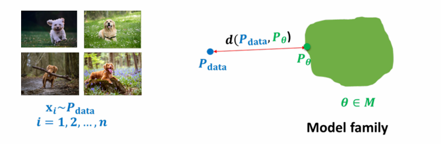

- We want to learn a probability distribution $p(x)$ over images $x$ such that
  - Generation: If $x_{\text{new}} \sim p(x)$, $x_{\text{new}}$ should look like a dog (sampling)
  - Density estimation: $p(x)$ is high if $x$ looks like a dog, low otherwise (anomaly detection)
  - Unsupervised representation learning: Learn common features (e.g., ears) of these images

- **Question**: How to represent $p(x)$?

### Basic discrete distributions
- Bernoulli distribution: (biased) coin flip
  - $D = \{\text{Head}, \text{Tail}\}$
  - Specify $\mathbb{P}(X = \text{Head}) = p$, so $\mathbb{P}(X = \text{Tail}) = 1 - p$
  - Write: $X \sim \text{Ber}(p)$
  - Sampling: Flip a (biased) coin

- Categorical distribution: (biased) $m$-sided dice
  - $D = \{1,2,...,m\}$
  - Specify $\mathbb{P}(Y = i) = p_i$ (satisfies $\sum_{i=1}^m p_i = 1$)
  - Write: $X \sim \text{Cat}(p_1,...,p_m)$
  - Sampling: Roll a (biased) die

### Example of joint distribution (single pixel color)
- Modeling the color of a single pixel (3 discrete random variables):
  - Red channel R: $\text{Val}(R) = \{0,...,255\}$
  - Green channel G: $\text{Val}(G) = \{0,...,255\}$
  - Blue channel B: $\text{Val}(B) = \{0,...,255\}$  

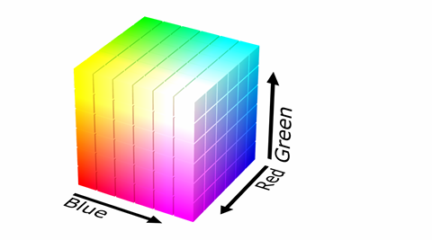

- Sampling from $(r,g,b) \sim p(R,G,B)$ generates a pixel color

- How many parameters do we need to specify the joint distribution?

### Example of joint distribution (binary images)
- Suppose $X_1,...,X_n$ are binary (Bernoulli) variables: $\text{Val}(X_i) = \{0,1\} = \{\text{Black, White}\}$  

  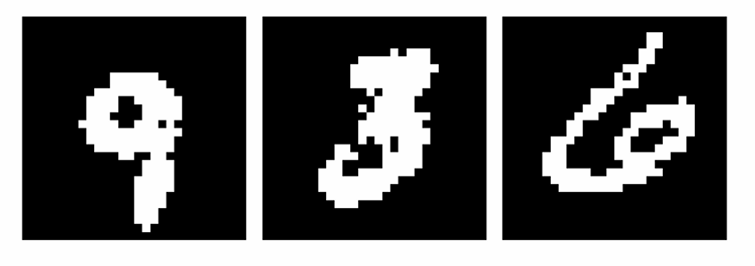

- How many possible images (states)? ($2^n$)

- Sampling from $p(x_1,...,x_n)$ generates an image

- How many parameters to specify $p(x_1,...,x_n)$?

### Structure through independence
- If $X_1,...,X_n$ are independent:  
  $p(x_1,...,x_n) = p(x_1)...p(x_n)$

- How many possible states?

- How many parameters to specify the joint distribution?

- Independence assumption is too strong (model not useful):
  - Example: Sampling independent pixels gives scattered, unstructured images  

  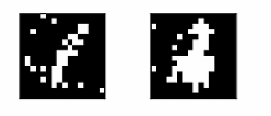

### Two important rules

- **Chain rule**: Let \( S_1, \dots, S_n \) be events, \( p(S_i) > 0 \)
  \[
  p(S_1 \cap S_2 \cap \dots \cap S_n) = p(S_1)p(S_2|S_1)\dots p(S_n|S_1 \cap \dots S_{n-1})
  \]

- **Bayes' rule**: Let \( S_1, S_2 \) be events, \( p(S_1) > 0 \) and \( p(S_2) > 0 \)
  \[
  p(S_1|S_2) = \frac{p(S_1 \cap S_2)}{p(S_2)} = \frac{p(S_1)p(S_2|S_1)}{p(S_2)}
  \]

### Structure through conditional independence

- **Using chain rule**:
  \[
  p(x_1, \dots, x_n) = p(x_1)p(x_2|x_1)\dots p(x_n|x_1, \dots, x_{n-1})
  \]

- For the binary case, how many parameters?

- Chain rule does not buy us anything

- Now suppose that \( X_{i+1} \perp X_1, \dots, X_{i-1}|X_i \), then
  \[
  p(x_1, \dots, x_n) = p(x_1)p(x_2|x_1)p(x_3|x_2)\dots p(x_n|x_{n-1})
  \]

- How many parameters?

### Bayes network: General idea

- Use conditional parameterization (instead of joint parameterization)

- For each random variable \( X_i \), specify \( p(x_i|x_{A_i}) \) for set \( \mathbf{X}_{A_i} \) of random variables

- Then get joint parameterization as
  \[
  p(x_1, \dots, x_n) = \prod_i p(x_i|x_{A_i})
  \]

- Need to guarantee that it is a legal probability distribution. It has to correspond to chain rule factorization, with factors simplified due to assumed conditional independencies

### Bayes networks

- A Bayesian network is specified by a directed acyclic graph (DAG) \( G = (V, E) \) with
  - One node \( i \in V \) for each random variable \( X_i \)
  - One conditional probability distribution (CPD) per node, \( p(x_i|\mathbf{x}_{\text{Pa}(i)}) \), specifying the prob. of the variable conditioned on the values of its parents

- Graph \( G = (V, E) \) is called the structure of the Bayesian network. It defines a joint distribution
  \[
  p(x_1, \dots, x_n) = \prod_{i \in V} p(x_i|\mathbf{x}_{\text{Pa}(i)})
  \]

- Claim: \( p(x_1, \dots, x_n) \) is a valid probability distribution because of the ordering implied by DAG

- Economical representation: Exponential in \( |\text{Pa}(i)| \), not \( |V| \)

### Example

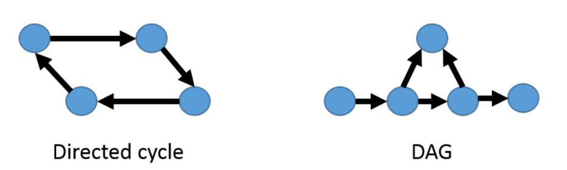

*Figure: DAG stands for directed acyclic graph.*

### Example
- Consider the following Bayesian network

（图示：贝叶斯网络包含节点：Difficulty、Intelligence、Grade、SAT、Letter，各节点附带条件概率表：
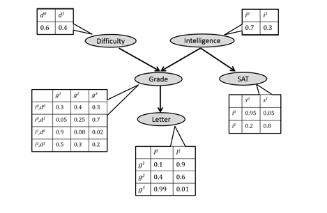

- What is its joint distribution?
$$p(x_1, \dots, x_n) = \prod_{i \in V} p(x_i|\mathbf{x}_{Pa(i)})$$
$$p(d, i, g, s, l) = p(d)p(i)p(g|d, i)p(s|i)p(l|g)$$

### Bayesian network structure implies conditional independence

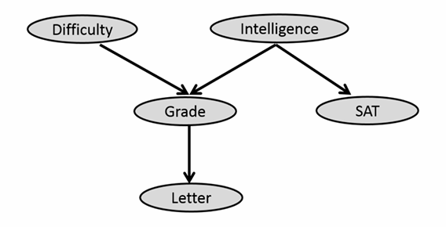

- The joint distribution corresponding to the above BN factors as
$$p(d, i, g, s, l) = p(d)p(i)p(g|d, i)p(s|i)p(l|g)$$

- However, by the chain rule, any distribution can be written as
$$p(d, i, g, s, l) = p(d)p(i|d)p(g|d, i)p(s|i, d, g)p(l|g, d, i, s)$$

- Thus, we are assuming the following additional independencies:
$$D \perp I,\ S \perp \{D, G\}|I,\ L \perp \{D, I, S\}|G$$

### Example: Naive Bayes for classification
- Classify emails as spam ($Y=1$) or not spam ($Y=0$)
  - Let $1:n$ index the words in our vocabulary (e.g., English)
  - $X_i = 1$ if the $i$-th word appears in an email, and 0 otherwise
  - Emails are drawn according to some distribution $p(X_1, \dots, X_n, Y)$

- Words are conditionally independent given $Y$:

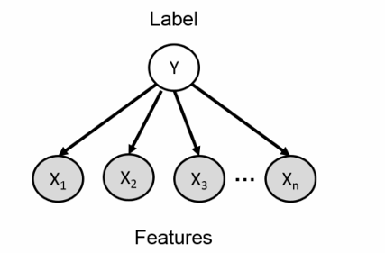

$$p(x_1, \dots, x_n, y) = p(y) \prod_{i=1}^n p(x_i|y)$$

### Example: Naive Bayes for classification
- Classify emails as spam ($Y=1$) or not spam ($Y=0$)
  - Let $1:n$ index the words in our vocabulary (e.g., English)
  - $X_i = 1$ if the $i$-th word appears in an email, and 0 otherwise
  - Emails are drawn according to some distribution $p(X_1, \dots, X_n, Y)$

- Then,
$$p(x_1, \dots, x_n, y) = p(y) \prod_{i=1}^n p(x_i|y)$$

- Estimate parameters from training data. Predict with Bayes' rule:
$$p(Y=1|x_1, \dots, x_n) = \frac{p(Y=1) \prod_{i=1}^n p(x_i|Y=1)}{\sum_{y=0}^1 p(Y=y) \prod_{i=1}^n p(x_i|Y=y)}$$

- Are the conditional independence assumptions made here reasonable?

- Philosophy: Nearly all probabilistic models are "wrong", but many are useful

### Example: Logistic regression for classification
- For the model, assume that
$$p(Y=1|\mathbf{x}; \alpha) = f(\mathbf{x}, \alpha)$$

- Not represented as a table anymore. It is a parameterized function of $\mathbf{x}$ (regression)
  - Has to be between 0 and 1
  - Depend in some simple but reasonable way on $x_1, \dots, x_n$
  - Completely specified by a vector $\alpha$ of $n+1$ parameters (compact representation)

- Linear dependence: Let $z(\alpha, \mathbf{x}) = \alpha_0 + \sum_{i=1}^n \alpha_i x_i$. Then,
$$p_\alpha(Y=1|\mathbf{x}) = \sigma(z(\alpha, \mathbf{x})) \quad \text{for } \sigma(z) = \frac{1}{1+e^{-z}} \ (\text{logistic/sigmoid function})$$

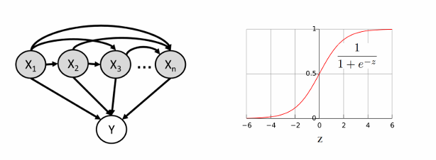

### Example: Neural models for classification
- Setting: Binary classification of $Y \in \{0,1\}$ given input features $X \in \{0,1\}^n$

- For classification, we care about $p(Y|\mathbf{x})$, and assume that $p_{\alpha}(Y|\mathbf{x}) = f_\alpha(\mathbf{x})$

- Logistic regression: We have
$$p_\alpha(Y=1|\mathbf{x}) = \sigma\left(\alpha_0 + \sum_{i=1}^n \alpha_i x_i\right) \quad \text{for } \sigma(z) = \frac{1}{1+e^{-z}} \ (\text{logistic/sigmoid function})$$

- Non-linear dependence: Let $\mathbf{h}(\mathbf{x}; \mathbf{A}, \mathbf{b})$ be a non-linear transform of the input, then
$$p_{\alpha, \mathbf{A}, \mathbf{b}}(Y=1|\mathbf{x}) = \sigma\left(\alpha_0 + \sum_j \alpha_j h_j\right)$$
  - More flexible but more parameters
  - Repeat multiple times to get a multi-layer perceptron (neural net)

以下是各页PPT对应的Markdown格式内容：

## Motivating example: Binarized MNIST
- Given: A dataset $\mathcal{D}$ of handwritten digits (binarized MNIST)
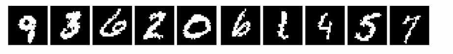
- Each image has $n = 28 \times 28 = 784$ pixels. Each pixel can either be black or white
- Goal: Learn a probability distribution $p(\mathbf{x}) = p(x_1, \dots, x_{784})$ over $\mathbf{x} \in \{0, 1\}^{784}$ such that when $\mathbf{x} \sim p(\mathbf{x})$, $\mathbf{x}$ looks like a digit
- Two-step process:
  - Parameterize a model family $\{p_\theta(\mathbf{x}) : \theta \in \Theta\}$
  - Search for model parameters $\theta$ based on training data $\mathcal{D}$

## Autoregressive models (ARMs)
- We can pick an ordering of all the random variables, i.e., raster scan ordering of pixels from top-left $(X_1)$ to bottom-right $(X_n; n = 784)$
- WLOG, we can use a chain rule for factorization
  $$p(x_1, \dots, x_n) = p(x_1)p(x_2|x_1)\dots p(x_n|x_1, \dots, x_{n-1})$$
- Based on logistic regression, we assume
  $$p(x_1, \dots, x_n) = p_{\alpha_1}(x_1)p_{\alpha_2}(x_2|x_1)\dots p_{\alpha_n}(x_n|x_1, \dots, x_{n-1})$$
- More specifically:
  - $p_{\alpha_1}(X_1 = 1) = \alpha_1, \ p_{\alpha_1}(X_1 = 0) = 1 - \alpha_1$
  - $p_{\alpha_2}(X_2 = 1|x_1) = \sigma(\alpha_{2,0} + \alpha_{2,1}x_1)$
  - $p_{\alpha_n}(X_n = 1|x_1, \dots, x_{n-1}) = \sigma\left(\alpha_{n,0} + \sum_{j=1}^{n-1}\alpha_{n,j}x_j\right)$
- Note: This is a modeling assumption. We are using parameterized functions to predict next pixel given all the previous ones. Called **autoregressive model**.

## Fully visible sigmoid belief networks (FVSBNs)
- The conditional variables $X_i|X_1, \dots, X_{i-1}$ are Bernoulli with
  $$\hat{x}_i := p_{\alpha_i}(X_i = 1|x_1, \dots, x_{i-1}) = \sigma\left(\alpha_{i,0} + \sum_{j=1}^{i-1}\alpha_{i,j}x_j\right)$$
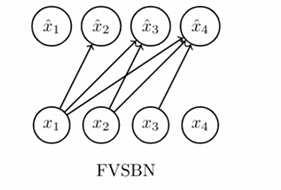
- To evaluate $p(x_1, \dots, x_n)$ (e.g., $p(X_1 = 0, X_2 = 1, X_3 = 1, X_4 = 0)$, only first 4 pixels):
  $$\begin{align*}
  p(X_1 = 0, X_2 = 1, X_3 = 1, X_4 = 0) &= (1 - \hat{x}_1)\hat{x}_2\hat{x}_3(1 - \hat{x}_4) \\
  &= (1 - \alpha_1)\sigma(\alpha_{2,0})\sigma(\alpha_{3,0} + \alpha_{3,2})(1 - \sigma(\alpha_{4,0} + \alpha_{4,2} + \alpha_{4,3}))
  \end{align*}$$
- How to sample from $p(x_1, \dots, x_n)$?
  - Sample $\bar{x}_1 \sim \text{Binom}(\alpha_1)$
  - Sample $\bar{x}_2 \sim \text{Binom}\left(\sigma(\alpha_{2,0} + \alpha_{2,1}\bar{x}_1)\right)\dots$
  - Sample $\bar{x}_n \sim \text{Binom}\left(\sigma\left(\alpha_{n,0} + \sum_{j=1}^{n-1}\alpha_{n,j}\bar{x}_j\right)\right)$

## FVSBN results
- Training data on the left (Caltech 101 Silhouettes). Generated samples on the right
- Figure from *Learning Deep Sigmoid Belief Networks with Data Augmentation*, AISTATS'15
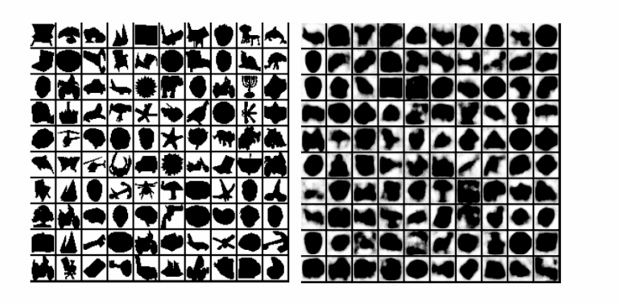

## Neural autoregressive distribution estimation (NADE)
- To improve the model: Use one-layer neural net instead of logistic regression
  $$\mathbf{h}_i = \sigma(\mathbf{A}_i\mathbf{x}_{<<i} + \mathbf{c}_i) \ (\sigma \text{ 按元素应用})$$
  $$\hat{x}_i = p_{\alpha_i, b_i, \mathbf{A}_i, \mathbf{c}_i}(X_i = 1|x_1, \dots, x_{i-1}) = \sigma(\alpha_i^\top \mathbf{h}_i + b_i)$$
  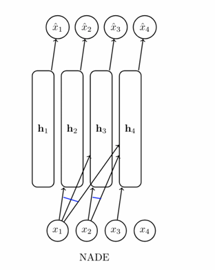
- Note: If $\mathbf{h}_i \in \mathbb{R}^d$, we have $\mathbf{A}_i \in \mathbb{R}^{d \times (i-1)}$ and $\mathbf{c}_i, \alpha_i \in \mathbb{R}^d$. How many parameters in total?

## Neural autoregressive distribution estimation (NADE)
- Tie weights to reduce the number of parameters and speed up computation
  $$\mathbf{h}_i = \sigma(\mathbf{W}_{<<i}\mathbf{x}_{<<i} + \mathbf{c}) \ (\sigma \text{ 按元素应用})$$
  $$\hat{x}_i = p_{\alpha_i, b_i, \mathbf{W}_{<<i}, \mathbf{c}}(X_i = 1|x_1, \dots, x_{i-1}) = \sigma(\alpha_i^\top \mathbf{h}_i + b_i)$$
  
- Note: If $\mathbf{h}_i \in \mathbb{R}^d$, we have $\mathbf{W} \in \mathbb{R}^{d \times n}$, $\mathbf{c} \in \mathbb{R}^d$, and $n$个逻辑回归系数向量 $[\alpha_i^\top, b_i]^\top \in \mathbb{R}^{d+1}$. How many parameters in total?

## NADE results
- (Left): Samples from NADE trained on a binary version of MNIST. (Right): Probabilities from which each pixel was sampled
- Figure from *The Neural Autoregressive Distribution Estimator*, AISTATS'11
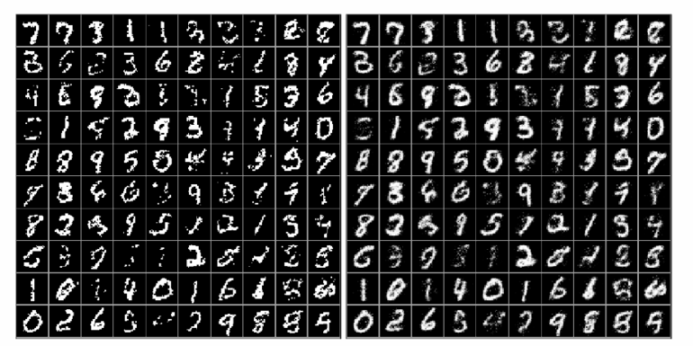

