### Why maximum likelihood?

- Maximum likelihood estimation (MLE):
  $$\hat{\theta} = \arg\max_\theta \sum_{i=1}^N \log p_\theta(x_i),\quad x_1,\dots,x_N \sim p_{\text{data}}(x)$$

- Optimal statistical efficiency:
  - Assume sufficient model capacity, s.t. there exists a unique $\theta^* \in \mathcal{M}$ such that $p_{\theta^*} = p_{\text{data}}$
  - The convergence of $\hat{\theta}$ to $\theta^*$ when $N \to \infty$ is the "fastest" among all statistical methods when using MLE

- Is the likelihood a good indicator of the quality of samples generated by the model?

---

### Towards likelihood-free learning

- Example for great test log-likelihoods, poor generated samples: For a discrete noise mixture model $p_\theta(x) = 0.01 p_{\text{data}}(x) + 0.99 p_{\text{noise}}(x)$
  - 99% of the samples are just noise (most samples are poor)
  - We have the lower bound:
    $$\log(p_\theta(x)) \geq \log(0.01 p_{\text{data}}(x)) = \log(p_{\text{data}}(x)) - \log(100)$$
    This gives $\mathbb{E}_{p_{\text{data}}} [\log(p_\theta(x))] \geq \mathbb{E}_{p_{\text{data}}} [\log(p_{\text{data}}(x))] - \log(100)$
  - We also have an upper bound $\mathbb{E}_{p_{\text{data}}} [\log(p_\theta(x))] \leq \mathbb{E}_{p_{\text{data}}} [\log(p_{\text{data}}(x))]$
  - As we increase the dimension $n$ of $\mathbf{x} = (x_1,\dots,x_n)$, absolute value of $\log(p_{\text{data}}(x)) = \sum_{i=1}^n \log(p_{\text{data}}(x_i|x_{<<i}))$ increases proportionally to $n$ but $\log(100)$ remains constant. Hence, $\mathbb{E}_{p_{\text{data}}} [\log(p_\theta(x))] \approx \mathbb{E}_{p_{\text{data}}} [\log(p_{\text{data}}(x))]$ for large $n$

---

### Towards likelihood-free learning

- Example for great generated samples, poor test log-likelihoods: Memorizing training set
  - Samples look exactly like the training data (cannot do better)
  - Test set will have zero probability assigned (cannot do worse)

- These examples suggest that it might be useful to disentangle likelihoods and sample quality

- Likelihood-free learning consider alternative training objectives that do not depend directly on a likelihood function

### Comparing distributions via samples

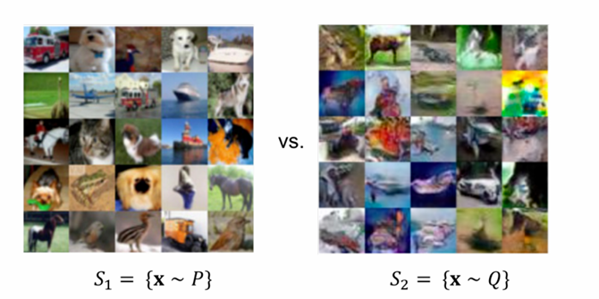

- Given a finite set of samples from two distributions \( S_1 = \{ \mathbf{x} \sim P \} \) and \( S_2 = \{ \mathbf{x} \sim Q \}, how can we tell if these samples are from the same distribution, i.e., \( P = Q \)?

### Two-sample tests

- Given \( S_1 = \{ \mathbf{x} \sim P \} \) and \( S_2 = \{ \mathbf{x} \sim Q \}, a two-sample test considers the following hypotheses:
  - Null hypothesis \( H_0: P = Q \)
  - Alternative hypothesis \( H_1: P \neq Q \)
- Test statistic \( T \) compares \( S_1 \) and \( S_2 \), e.g., difference in means:
  $$ T(S_1, S_2) = \left\| \frac{1}{|S_1|} \sum_{\mathbf{x} \in S_1} \mathbf{x} - \frac{1}{|S_2|} \sum_{\mathbf{x} \in S_2} \mathbf{x} \right\|_2 $$
- If \( T \) is larger than a threshold \( \alpha \), then reject \( H_0 \), otherwise accept \( H_0 \)
- Notably, test statistic is likelihood-free since it does not involve the densities \( P \) or \( Q \) (only samples)

### Generative modeling and two-sample tests
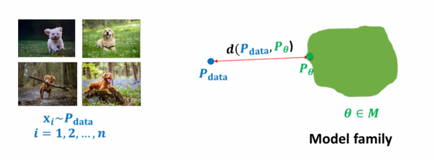

- We assume direct access to \( S_1 = \mathcal{D} = \{ \mathbf{x} \sim p_{\text{data}} \} \)
- Additionally, we have a model distribution \( p_\theta \)
- Assume that the model distribution permits efficient sampling. Let \( S_2 = \{ \mathbf{x} \sim p_\theta \} \)
- Alternative notion of distance between distributions: Train the generative model to minimize a two-sample test objective between \( S_1 \) and \( S_2 \)

### Two-sample test via a discriminator

- Finding a good two-sample test objective in high-dimensions is hard
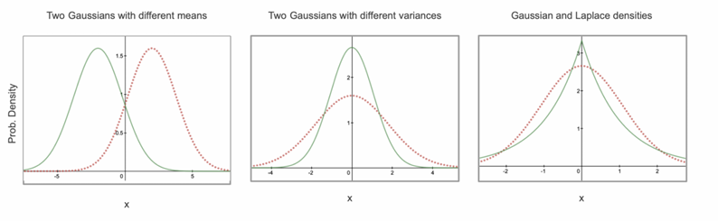
- In the generative model setup, we know that \( S_1 \) and \( S_2 \) come from different distributions \( p_{\text{data}} \) and \( p_\theta \) resp.
- Learn a statistic to automatically identify in what way the two sets of samples \( S_1 \) and \( S_2 \) differ from each other
- How? Train a classifier (called a discriminator)!

### Two-sample test via a discriminator

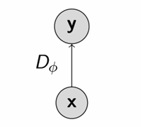

- Two-sample test via a discriminator:
  - Any binary classifier \( D_\phi \) (e.g., neural net) which tries to distinguish "real" (\( y = 1 \)) samples from the dataset and "fake" (\( y = 0 \)) samples generated from the model
  - Test statistics: Negative loss of the classifier. Low loss → real and fake samples are easy to distinguish (different); High loss → real and fake samples are hard to distinguish (similar)
- Goal: Maximize the two-sample test statistics (accept the alternative hypothesis \( p_{\text{data}} \neq p_\theta \)), or equivalently minimize the classification loss

## Two-sample test via a discriminator

- Training objective for discriminator:
  $$
  \mathbb{E}_{x \sim p_{\text{data}}} \left[ \log(D_\phi(x)) \right] + \mathbb{E}_{x \sim p_\theta} \left[ \log(1 - D_\phi(x)) \right]
  \approx \sum_{x \in S_1} \log(D_\phi(x)) + \sum_{x \in S_2} \log(1 - D_\phi(x))
  $$

- For a fixed generative model \( p_\theta \), the discriminator is performing binary classification with the cross entropy objective
  $$
  -\sum_{i=1}^N \left( y_i \log(\hat{y}_i) + (1 - y_i) \log(1 - \hat{y}_i) \right)
  $$
  where for \( y_i = 1 \) for \( x_i \in S_1 \), \( y_i = 0 \) for \( x_i \in S_2 \), and \( \hat{y}_i = D_\phi(x_i) \)

- Optimal discriminator (in general, outputting continuous probability in [0,1] rather than binary value in {0,1}) (Why?)
  $$
  D^*_\theta(x) = \frac{p_{\text{data}}(x)}{p_{\text{data}}(x) + p_\theta(x)}
  $$

- Sanity check: If \( p_\theta = p_{\text{data}} \), classifier cannot do better than chance (i.e., \( D^*_\theta = 1/2 \))

## Generative adversarial networks

- A two-play minimax game between a generator and a discriminator
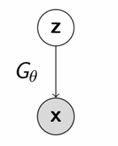

- Generator:
  - Directed, latent variable model with a deterministic mapping between \( z \) and \( x \) given by \( G_\theta \)
  - Sample \( z \sim p_z \), where \( p_z \) is a simple prior; set \( x = G_\theta(z) \)
  - Similar to the generation process of Gaussian VAEs
  - Minimizes a two-sample test objective (in support of the null hypothesis \( p_{\text{data}} = p_\theta \))

## Example of GAN objective

- The optimization problem corresponding to the training of GAN:
  $$
  \min_G \max_D \left( \mathbb{E}_{x \sim p_{\text{data}}} [\log(D(x))] + \mathbb{E}_{x \sim p_G} [\log(1 - D(x))] \right)
  $$

- For the optimal discriminator \( D^*_G(\cdot) \), we have
  $$
  \begin{aligned}
  V(G, D^*_G) &= \mathbb{E}_{x \sim p_{\text{data}}} \left[ \log \left( \frac{p_{\text{data}}(x)}{p_{\text{data}}(x) + p_G(x)} \right) \right] + \mathbb{E}_{x \sim p_G} \left[ \log \left( \frac{p_G(x)}{p_{\text{data}}(x) + p_G(x)} \right) \right] \\
  &= \mathbb{E}_{x \sim p_{\text{data}}} \left[ \log \left( \frac{p_{\text{data}}(x)}{(p_{\text{data}}(x) + p_G(x))/2} \right) \right] + \mathbb{E}_{x \sim p_G} \left[ \log \left( \frac{p_G(x)}{(p_{\text{data}}(x) + p_G(x))/2} \right) \right] - \log(4) \\
  &= 2\text{JS}(p_{\text{data}} \| p_G) - \log(4)
  \end{aligned}
  $$

## Jensen-Shannon (JS) divergence

- JS divergence between two distributions \( P \sim p \) and \( Q \sim q \):
  $$
  \text{JS}(P\|Q) = \text{JS}(p\|q) = \frac{1}{2}\text{KL}\left( p \middle\| \frac{p+q}{2} \right) + \frac{1}{2}\text{KL}\left( q \middle\| \frac{p+q}{2} \right)
  $$

- Properties:
  - \( \text{JS}(p\|q) \geq 0 \)
  - \( \text{JS}(p\|q) = 0 \) iff \( p = q \)
  - \( \text{JS}(p\|q) = \text{JS}(q\|p) \) (symmetric)

- Optimal generator for the JS-divergence GAN:
  $$
  p_{G^*} = p_{\text{data}}
  $$

- For the optimal discriminator \( D^*_{G^*}(\cdot) \) and generator \( G^*(\cdot) \), we have
  $$
  V(G^*, D^*_{G^*}) = -\log(4)
  $$

## Recap of GANs

- Choose \( d(P_{\text{data}}, P_\theta) \) to be a two-sample test statistic
  - Learn the statistic by training a classifier (discriminator)
  - Under ideal conditions, equivalent to choosing \( d(P_{\text{data}}, P_\theta) \) to be \( \text{JS}(P_{\text{data}}\|P_\theta) \)

- Pros:
  - Loss only requires samples from \( p_\theta \). No likelihood needed!
  - Lots of flexibility of the NN architecture
  - Fast sampling (single forward pass)

- Cons: Very difficult to train in practice

### The GAN training procedure

- More precise optimization problem:
  $$\min_{\boldsymbol{\theta}} \max_{\boldsymbol{\phi}} \left[ \mathbb{E}_{\mathbf{x} \sim p_{\text{data}}} \left[ \log(D_{\boldsymbol{\phi}}(\mathbf{x})) \right] + \mathbb{E}_{\mathbf{z} \sim p_{\mathbf{z}}} \left[ \log(1 - D_{\boldsymbol{\phi}}(G_{\boldsymbol{\theta}}(\mathbf{z}))) \right] \right]$$

- Training procedure:
  - Sample minibatch of \( m \) training points \( \mathbf{x}_1, \dots, \mathbf{x}_m \) from \( \mathcal{D} \), and sample minibatch of \( m \) noise vectors \( \mathbf{z}_1, \dots, \mathbf{z}_m \) from \( p_{\mathbf{z}} \)
  - Update the discriminator parameter \( \boldsymbol{\phi} \) by stochastic gradient ascent
    $$\boldsymbol{\phi} \leftarrow \boldsymbol{\phi} + \frac{\eta_1}{m} \nabla_{\boldsymbol{\phi}} \left( \sum_{i=1}^m \left( \log(D_{\boldsymbol{\phi}}(\mathbf{x}_i)) + \log(1 - D_{\boldsymbol{\phi}}(G_{\boldsymbol{\theta}}(\mathbf{z}_i))) \right) \right)$$
  - Update the generator parameter \( \boldsymbol{\theta} \) by stochastic gradient descent
    $$\boldsymbol{\theta} \leftarrow \boldsymbol{\theta} - \frac{\eta_2}{m} \nabla_{\boldsymbol{\theta}} \left( \sum_{i=1}^m \log(1 - D_{\boldsymbol{\phi}}(G_{\boldsymbol{\theta}}(\mathbf{z}_i))) \right)$$
  - Repeat for fixed number of epochs

### Frontiers in GAN research
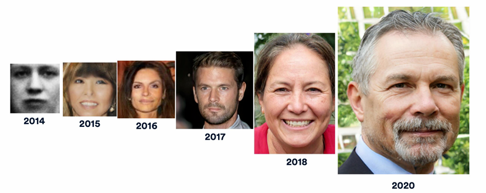

- GANs have been successfully applied to several domains and tasks
- However, working with GANs can be very challenging in practice
  - Unstable training
  - Mode collapse
- Bag of tricks needed to train GANs successfully

### Optimization challenges

- Theorem (informal): If the generator updates are in function space and discriminator is optimal at every step, then the generator is guaranteed to converge to the data distribution
- Unrealistic assumptions!
- In practice, the generator and discriminator loss keeps oscillating during training

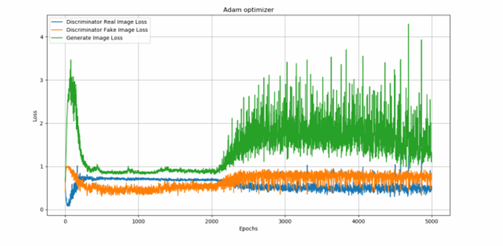

- No robust stopping criteria in practice

### 1. Mode collapse

- GANs are notorious for suffering from mode collapse
- Intuitively, this refers to the phenomena where the generator of a GAN collapses to one or few samples (dubbed as "modes")

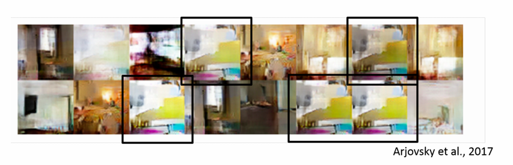

### 2. Mode collapse

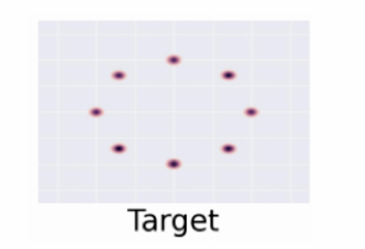

- True distribution is a mixture of Gaussians

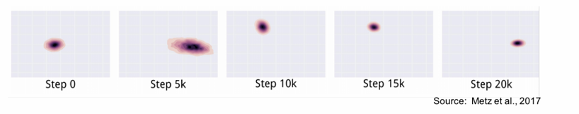

- The generator distribution keeps oscillating between different modes

### 3. Mode collapse

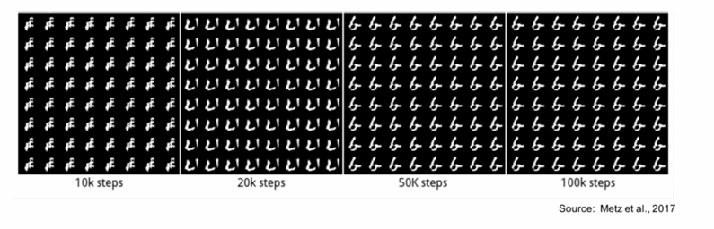

- Fixes to mode collapse are mostly empirically driven: Alternative architectures, alternative GAN loss, adding regularization terms
- How to Train a GAN? Tips and tricks to make GANs work (by Soumith Chintala; https://github.com/soumith/ganhacks)

### 4. Beyond KL and JS divergences

- What choices do we have for $d(P_{\text{data}}, P_\theta)$?
  - KL divergence: VAEs, ARMs
  - (scaled and shifted) JS divergence (approximately): Vanilla GAN

### 5. f-divergences

- Let $P \sim p$ and $Q \sim q$ be distributions on $\mathcal{X} = \mathbb{R}^d$, and let $f: \mathbb{R}_+ \to \mathbb{R}$ be convex, lower-semicontinuous with satisfying $f(1) = 0$. The $f$-divergence between $P$ and $Q$ is  
  $$D_f(P\|Q) = D_f(p\|q) := \int q(x)f\left( \frac{p(x)}{q(x)} \right) dx$$

- Lower-semicontinuous: $f$ is lower-semicontinuous at $x_0$ iff  
  $$\liminf_{x \to x_0} f(x) \geq f(x_0)$$  
  where the limit inferior $\liminf_{x \to x_0} f(x) = \sup_{\varepsilon > 0} \inf\{ f(x) : x \in (x_0 - \varepsilon, x_0 + \varepsilon) \}$

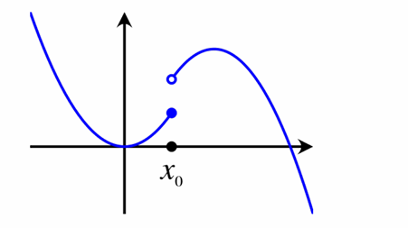

- **Question**: Why $f$-divergence is non-negative?

### f-divergences

- Examples:
  - KL-divergence with \( f(t) = t\log t \)
  - TV-distance with \( f(t) = \frac{1}{2}|t - 1| \)

- Many more f-divergences

| Name                  | \( D_f(P\|Q) \)                                                                 | Generator \( f(u) \)                              |
|-----------------------|---------------------------------------------------------------------------------|---------------------------------------------------|
| Total variation       | \( \frac{1}{2} \int |p(x) - q(x)| dx \)                                          | \( \frac{1}{2}|u - 1| \)                           |
| Kullback-Leibler      | \( \int p(x) \log \frac{p(x)}{q(x)} dx \)                                        | \( u \log u \)                                     |
| Reverse Kullback-Leibler | \( \int q(x) \log \frac{q(x)}{p(x)} dx \)                                      | \( -\log u \)                                      |
| Pearson \( \chi^2 \)   | \( \int \frac{(p(x)-q(x))^2}{q(x)} dx \)                                          | \( (u - 1)^2 \)                                    |
| Neyman \( \chi^2 \)    | \( \int \frac{(p(x)-q(x))^2}{p(x)} dx \)                                          | \( \frac{(1 - u)^2}{u} \)                          |
| Squared Hellinger     | \( \int \left( \sqrt{p(x)} - \sqrt{q(x)} \right)^2 dx \)                          | \( (\sqrt{u} - 1)^2 \)                             |
| Jeffery               | \( \int (p(x) - q(x)) \log \frac{p(x)}{q(x)} dx \)                                | \( (u - 1) \log u \)                               |
| Jensen-Shannon        | \( \frac{1}{2} \int p(x) \log \frac{2p(x)}{p(x)+q(x)} + q(x) \log \frac{2q(x)}{p(x)+q(x)} dx \) | \( -(u + 1) \log \frac{1+u}{2} + u \log u \)       |
| Jensen-Shannon-weighted | \( \int p(x) \log \frac{\pi p(x)}{\pi p(x)+(1-\pi)q(x)} + (1 - \pi)\frac{q(x)}{\pi}\log \frac{q(x)}{\pi p(x)+(1-\pi)q(x)} dx \) | \( \pi u \log u - (1 + \pi u) \log(1 + \pi u) + u \log u \) |
| GAN                   | \( \pi \log u - u + 1 + \pi u \log(u + 1) \)                                      | \( \pi \log u - u + 1 + \pi u \log(u + 1) \)        |
| \( \alpha \)-divergence (\( \alpha \notin \{0,1\} \)) | \( \frac{1}{\alpha(1-\alpha)} \int \left( p(x) \left[ \left( \frac{p(x)}{q(x)} \right)^{\alpha-1} - 1 \right] - \alpha (q(x) - p(x)) \right) dx \) | \( \frac{1}{\alpha(1-\alpha)} (u^{\alpha} - 1 - \alpha (u - 1)) \) |

Source: Nowozin et al., 2016

---

### Training with f-divergences

- Given \( p_{\text{data}} \) and \( p_{\theta} \), we could minimize \( D_f(p_{\text{data}} \| p_{\theta}) \) or \( D_f(p_{\theta} \| p_{\text{data}}) \) as learning objectives

- However, they depend on the density ratio which is unknown
  \[
  D_f(p_{\text{data}} \| p_{\theta}) = \mathbb{E}_{p_{\theta}} \left[ f \left( \frac{p_{\text{data}}(\mathbf{x})}{p_{\theta}(\mathbf{x})} \right) \right]
  \]
  \[
  D_f(p_{\theta} \| p_{\text{data}}) = \mathbb{E}_{p_{\text{data}}} \left[ f \left( \frac{p_{\theta}(\mathbf{x})}{p_{\text{data}}(\mathbf{x})} \right) \right]
  \]

- To use f-divergences as a two-sample test objective for likelihood-free learning, we need to be able to estimate the objective using only samples (e.g., training data and samples from the model)

---

### Towards variational divergence minimization

- The function \( f^* \) is the convex conjugate of \( f \), defined by
  \[
  f^*(t) = \sup_x (xt - f(x))
  \]

- \( f^* \) is convex (pointwise supremum of convex functions is convex) and lower semi-continuous

- Let \( f^{**} \) be the convex conjugate of \( f^* \), with \( f^{**}(x) = \sup_t (tx - f^*(t)) \). Then \( f \geq f^{**} \)
  Proof: By the definition of \( f^* \), we have \( f^*(t) \geq xt - f(x) \) for any \( x \) and \( t \). This gives \( f(x) \geq xt - f^*(t) \) for any \( x \) and \( t \), and thus \( f(x) \geq \sup_t (xt - f^*(t)) = f^{**}(x) \) for any \( x \).

- Fenchel duality: When \( f \) is convex and lower-semicontinuous, \( f^{**} = f \)

---

### f-GAN: Variational divergence minimization

- We have the following via Fenchel duality
  \[
  \begin{aligned}
  D_f(p\|q) &= \mathbb{E}_{x \sim q} \left[ f \left( \frac{p(x)}{q(x)} \right) \right] \\
  &= \mathbb{E}_{x \sim q} \left[ f^{**} \left( \frac{p(x)}{q(x)} \right) \right] \\
  &= \mathbb{E}_{x \sim q} \left[ \sup_t \left( t \times \frac{p(x)}{q(x)} - f^*(t) \right) \right] \\
  &= \mathbb{E}_{x \sim q} \left[ \left( T^*(x) \times \frac{p(x)}{q(x)} - f^*(T^*(x)) \right) \right] \\
  &= \int q(x) \left( T^*(x) \times \frac{p(x)}{q(x)} - f^*(T^*(x)) \right) dx \\
  &= \int \left( T^*(x)p(x) - f^*(T^*(x))q(x) \right) dx \\
  &= \sup_T \int \left( T(x)p(x) - f^*(T(x))q(x) \right) dx \\
  &= \sup_T \left( \mathbb{E}_{x \sim p}[T(x)] - \mathbb{E}_{x \sim q}[f^*(T(x))] \right)
  \end{aligned}
  \]
  where \( T \) denotes a mapping from \( \mathcal{X} = \mathbb{R}^d \) to \( \mathbb{R} \)

---

### The vanilla GAN

- We have \( D_f(p\|q) = \sup_T \left( \mathbb{E}_{x \sim p}[T(x)] - \mathbb{E}_{x \sim q}[f^*(T(x))] \right) \)

- Let \( p = p_{\text{data}} \) and \( q = p_{\theta} \), and parameterize \( T \) by \( \phi \) and \( G \) by \( \theta \)

- Consider the following f-GAN optimization
  \[
  \min_{\theta} D_f(p_{\text{data}} \| p_{\theta}) = \min_{\theta} \max_{\phi} \left( \mathbb{E}_{x \sim p_{\text{data}}}[T_{\phi}(x)] - \mathbb{E}_{x \sim p_{\theta}}[f^*(T_{\phi}(x))] \right)
  \]

- Substitute any f-divergence and optimize the f-GAN objective

- For example, choosing \( f(x) = x\log(x) - (x + 1)\log(x + 1) \), we obtain (Why?)
  \[
  D_f(p\|q) = \int q(x)f \left( \frac{p(x)}{q(x)} \right) dx = 2\text{JS}(p\|q) - \log(4)
  \]

- The convex conjugate of \( f \) is \( f^*(t) =? \)

- Setting \( T_{\phi}(x) = \log(D_{\phi}(x)) \). Then, we obtain the vanilla GAN optimization!
  \[
  \min_{\theta} \max_{\phi} \left( \mathbb{E}_{x \sim p_{\text{data}}}[\log(D_{\phi}(x))] + \mathbb{E}_{z \sim p_z}[\log(1 - D_{\phi}(G_{\theta}(z)))] \right)
  \]

