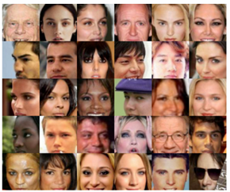
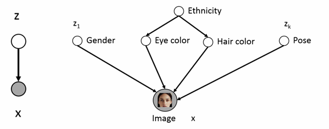
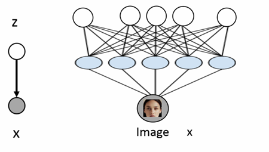
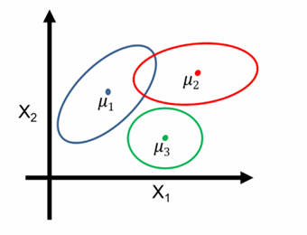
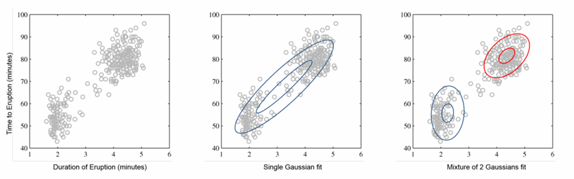
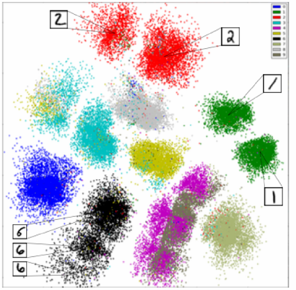
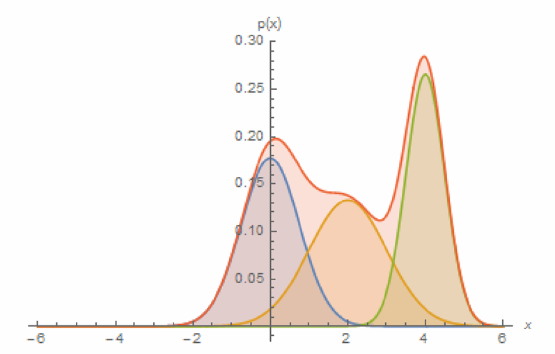
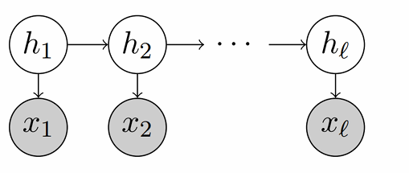

- Lots of variability in images \( \mathbf{x} \) due to gender, eye color, hair color, pose, etc. However, unless images are annotated, these factors of variation are not explicitly available (latent)
- Idea: Explicitly model these factors using latent variables \( \mathbf{z} \)

- Only shaded variables \( \mathbf{x} \) are observed in the data (pixel values)
- Latent variables \( \mathbf{z} \) correspond to high level features

  - If \( \mathbf{z} \) chosen properly, \( p(\mathbf{x}|\mathbf{z}) \) could be much simpler than \( p(\mathbf{x}) \)
  - If we had trained this model, then we could identify features via \( p(\mathbf{z}|\mathbf{x}) \), e.g., \( p(\text{EyeColor}=\text{Blue}|\mathbf{x}) \)
  - Challenge: Very difficult to specify these conditionals by hand

### Deep latent variable models

- Use neural networks to model the conditionals (deep latent variable models):
  - \( z \sim \mathcal{N}(0, \mathbf{I}) \)
  - \( p(\mathbf{x}|z) = \mathcal{N}(\mathbf{x}; \mu_\theta(z), \Sigma_\theta(z)) \) where \( \mu_\theta \) and \( \Sigma_\theta \) are neural networks
- Hope that after training, \( z \) will correspond to meaningful latent factors of variation (features)
- As before, features can be computed via \( p(z|\mathbf{x}) \)

### Mixture of Gaussians: A shallow latent variable model
- Mixture of Gaussians (or Gaussian mixture models (GMMs)). Bayes net: \( z \to \mathbf{x} \)
  - \( z \sim \text{Categorical}_{\pi^*}(1, \dots, K) \)
  - \( p(\mathbf{x}|z = k) = \mathcal{N}(\mathbf{x}; \mu_k^*, \Sigma_k^*) \)

- Generative process:
  - Pick a mixture component \( k \) by sampling \( z \)
  - Generate a data point by sampling from that Gaussian

### Mixture of Gaussians: A shallow latent variable model
- Mixture of Gaussians (or Gaussian mixture models (GMMs)). Bayes net: \( z \to \mathbf{x} \)
  - \( z \sim \text{Categorical}_{\pi^*}(1, \dots, K) \)
  - \( p(\mathbf{x}|z = k) = \mathcal{N}(\mathbf{x}; \mu_k^*, \Sigma_k^*) \)

- Clustering: The posterior \( p(z|\mathbf{x}) \) identifies the mixture component
- Unsupervised learning: We are hoping to learn from unlabeled data (ill-posed problem)

### Unsupervised learning
- Unsupervised clustering of handwritten digits

### Gaussian mixture models
- Alternative motivation: Combine simple models into a more complicated and expressive one

- For Gaussian density \( \mathcal{N}(\mathbf{x}; \mu, \Sigma) = \frac{1}{\sqrt{(2\pi)^d \cdot \det(\Sigma)}} \exp\left( -\frac{1}{2}(\mathbf{x} - \mu)^\top \Sigma^{-1} (\mathbf{x} - \mu) \right) \):
  \[
  p(\mathbf{x}) = \sum_z p(\mathbf{x}, z) = \sum_z p(z) p(\mathbf{x}|z) = \sum_{k=1}^K p(z = k) \mathcal{N}(\mathbf{x}; \mu_k^*, \Sigma_k^*) = \sum_{k=1}^K \pi_k^* \mathcal{N}(\mathbf{x}; \mu_k^*, \Sigma_k^*)
  \]

### A small clarification
- A formal course in probability will carefully distinguish between
  - Random variables, e.g., \( X : \Omega \to \mathbb{R}^d \)
  - Samples, e.g., \( x_1, x_2, \dots, x_N \in \mathbb{R}^d \)
- I will regularly blur the distinction between these objects
- If it helps, I will never talk about formal construction \( \Omega \) in this course

### Learning Gaussian mixture models (GMMs)
- The underlying parameter of the GMM: \( \theta^* = \{\pi^*, \{\mu_k^*\}_{k=1}^K, \{\Sigma_k^*\}_{k=1}^K \} \)
- Suppose that we have \( n \) observations \( \mathbf{x}_1, \mathbf{x}_2, \dots, \mathbf{x}_n \) of the GMM, how can we learn the parameter \( \theta^* \)?
- A natural idea is considering maximum likelihood estimation (MLE):
  \[
  \hat{\theta} = \arg \max_{\theta} \frac{1}{N} \sum_{i=1}^N \log p_{\theta}(x_i) = \arg \max_{\theta} \frac{1}{N} \sum_{i=1}^N \log \left( \sum_{k=1}^K \pi_k \mathcal{N}(x; \mu_k, \Sigma_k) \right)
  \]
- No analytic solution; non-convex optimization problem
- Expectation maximization (EM) algorithm is classic for learning GMMs

### Jensen's Inequality
- For a concave \( f \) and \( \alpha \in \Delta^{N-1} := \{\mathbf{v} \in \mathbb{R}^N : v_n \in [0,1] \forall n \in [N], \sum_{n=1}^N v_n = 1\} \), we have
  \[
  f\left( \sum_{n=1}^N \alpha_n x_n \right) \geq \sum_{n=1}^N \alpha_n f(x_n)
  \]
- In particular, \( \log(\cdot) \) is a concave function
- Using Jensen's Inequality (for concave functions):
  \[
  \log\left( \mathbb{E}_{z \sim q(z)} [g(z)] \right) = \log\left( \sum_{z} q(z) g(z) \right) \geq \sum_{z} q(z) \log(g(z))
  \]

### Variational inference
- Old ML learning objective: \( \max_{\theta} \sum_{i=1}^N \log\left( \int p_{\theta}(x_i, z) dz \right) \)
- Theorem: The log likelihood can be written as
  \[
  \log p_{\theta}(x) = \max_{q(\cdot|x): q(\cdot|x) \geq 0, \int q(z|x)dz=1} \int q(z|x) \log\left( \frac{p_{\theta}(x, z)}{q(z|x)} \right) dz,
  \]
  and the maximizing distribution is given by \( p_{\theta}(\cdot|x) \) (which can be calculated from Bayes' rule with \( p_{\theta}(z|x) = p_{\theta}(x|z) p_{\theta}(z)/p_{\theta}(x) \)).
  Proof (informal): When \( q(\cdot|x) = p_{\theta}(\cdot) \), we have
  \[
  \int q(z|x) \log\left( \frac{p_{\theta}(x, z)}{q(z|x)} \right) dz = \int q(z|x) \log\left( \frac{p_{\theta}(x, z)}{p_{\theta}(z|x)} \right) dz = \log p_{\theta}(x).
  \]
  On the other hand, by Jensen's inequality, we have for any \( q(\cdot|x) \) that
  \[
  \log p_{\theta}(x) = \log \int q(z|x) \frac{p_{\theta}(x, z)}{q(z|x)} dz \geq \int q(z|x) \log\left( \frac{p_{\theta}(x, z)}{q(z|x)} \right) dz.
  \]
- New ML learning objective: \( \max_{\theta} \sum_{i=1}^N \max_{q(\cdot|x_i)} \int q(z|x_i) \log\left( \frac{p_{\theta}(x_i,z)}{q(z|x_i)} \right) dz \)

### Variational inference
- New ML learning objective: \( \max_{\theta} \sum_{i=1}^N \max_{q(\cdot|x_i)} \int q(z|x_i) \log\left( \frac{p_{\theta}(x_i,z)}{q(z|x_i)} \right) dz \)
  - If \( p_{\theta}(z|x) \) is "accessible", then we can alternate between optimizing w.r.t. \( \theta \) with \( q(\cdot|x_i) \)'s fixed and vice versa, leading to the EM algorithm
    - Promise: In many cases, we will get closed-form solutions in each step
  - Else, parameterize \( q(\cdot|x_i) \) with a neural network that takes \( x_i \) and outputs a distribution \( q_{\phi}(\cdot|x_i) \)
    - Finding \( \phi \) will typically be done by gradient descent

### Expectation maximization
- New ML learning objective: $\max_\theta \sum_{i=1}^N \max_{q(\cdot|x_i)} \int q(z|x_i) \log \left( \frac{p_\theta(x_i,z)}{q(z|x_i)} \right) dz$

- EM alternates between two steps:
  - E-step: $q^{(\ell)}(\cdot|x_i) = p_{\theta^{(\ell)}}(\cdot|x_i)$
  - M-step: $\theta^{(\ell+1)} = \arg \max_\theta \sum_{i=1}^N \int q^{(\ell)}(z|x_i) \log(p_\theta(x_i,z))dz$

- Recall the procedure of the $k$-means algorithm

### EM for GMMs
- EM alternates between two steps:
  - E-step: $q^{(\ell)}(\cdot|x_i) = p_{\theta^{(\ell)}}(\cdot|x_i)$
    $$
    q^{(\ell)}(z|x_i) = p_{\theta^{(\ell)}}(z|x_i) = \frac{p_{\theta^{(\ell)}}(x_i|z)p_{\theta^{(\ell)}}(z)}{p_{\theta^{(\ell)}}(x_i)} \\
    = \frac{\pi_z^{(\ell)} \mathcal{N}(x_i; \mu_z^{(\ell)}, \Sigma_z^{(\ell)})}{\sum_{k=1}^K \pi_k^{(\ell)} \mathcal{N}(x_i; \mu_k^{(\ell)}, \Sigma_k^{(\ell)})}
    $$
  - M-step:
    $$
    \theta^{(\ell+1)} = \arg \max_\theta \sum_{i=1}^N \int q^{(\ell)}(z|x_i) \log(p_\theta(x_i,z))dz \\
    = \arg \max_\theta \sum_{i=1}^N \sum_{k=1}^K q^{(\ell)}(k|x_i) \log(p_\theta(x_i, k)) \\
    = \arg \max_\theta \sum_{i=1}^N \sum_{k=1}^K q^{(\ell)}(k|x_i) \log(p_\theta(k)p_\theta(x_i|k))
    $$

- Question (Exercise): When focusing on spherical GMMs with $\Sigma_k^* = (\sigma_k^*)^2 \mathbf{I}_d$ (where $d$ is the data dimension), what is the closed-form update rule for the M-step?

### Hidden Markov model (HMM)
- Consider a Markov chain of discrete hidden states $\mathbf{h}_1 \to \mathbf{h}_2 \to \dots$ over $K$ possible states: Given $\mathbf{h}_t$ at time $t$, the observation $x_t$ (a random vector in $\mathbb{R}^D$) is independent of all other observations/hidden states.

- Let $\pi^* \in \Delta^{K-1} := \{ \mathbf{v} \in \mathbb{R}^K : v_k \in [0,1] \forall k \in [K], \sum_{k=1}^K v_k = 1 \}$ be the initial state distribution (for $\mathbf{h}_1$), and $\mathbf{T}^* \in \mathbb{R}^{K \times K}$ be the transition matrix:
  $$
  \mathbb{P}(\mathbf{h}_{t+1} = s_j | \mathbf{h}_t = s_i) = T_{ij}^*
  $$

- Let $\mathbf{O}^* \in \mathbb{R}^{D \times K}$ (its $j$-th column is $\mathbb{E}[x_t | \mathbf{h}_t = s_j]$): For all $t$,
  $$
  \mathbb{E}[x_t | \mathbf{h}_t = s_j] = \mathbf{O}^* \mathbf{e}_j
  $$

- Practical example: Non-intrusive load monitoring

### Single topic model
- Let $K$ = number of distinct topics in the corpus; $D$ = number of distinct words in the vocabulary.

- Generative process for a document: The document’s topic $z$ is drawn from a discrete distribution (probability vector $\mathbf{w} \in \Delta^{K-1}$).

- Given $z$, the $N$ words are drawn independently from a discrete distribution (probability vector $\boldsymbol{\mu}_z^* \in \Delta^{d-1}$).

- Represent words as $D$-dimensional vectors: $x_n = \mathbf{e}_i$ iff the $n$-th word is the $i$-th vocabulary word.

- In this model: We observe $x_1, \dots, x_N$ (document words) given a fixed $z$ (document topic).

### Latent Dirichlet allocation (LDA)
- LDA is a mixed membership document model: Each document corresponds to a **mixture over topics** (not a single topic).

- Topic mixtures follow a Dirichlet distribution $\text{Dir}(\boldsymbol{\alpha}^*)$ (parameter $\boldsymbol{\alpha}^* \in \mathbb{R}_{++}^K$, strictly positive entries). Its density over $\Delta^{K-1}$:
  $$
  p_{\boldsymbol{\alpha}^*}(\mathbf{h}) = \frac{\Gamma(\alpha_0^*)}{\prod_{k=1}^K \Gamma(\alpha_k^*)} \cdot \prod_{k=1}^K h_k^{\alpha_k^* - 1}, \quad \mathbf{h} \in \Delta^{K-1},
  $$
  where $\alpha_0^* = \sum_{k=1}^K \alpha_k^*$.
  - $\Gamma(s) := \int_0^\infty x^{s-1} e^{-x} dx$ (property: $\Gamma(s+1) = s\Gamma(s)$; for $s \in \mathbb{N}_+$, $\Gamma(s+1) = s!$).

- $K$ topics are defined by probability vectors $\boldsymbol{\mu}_1^*, \dots, \boldsymbol{\mu}_K^* \in \Delta^{K-1}$. To generate a document:
  1. Draw topic mixture $\mathbf{h} = [h_1, \dots, h_K] \sim \text{Dir}(\boldsymbol{\alpha}^*)$.
  2. For each word $x_n$: Sample a topic $j$ (per $\mathbf{h}$), then sample $x_n$ (per $\boldsymbol{\mu}_j^*$) — so $x_n$ follows $\sum_{k=1}^K h_k \boldsymbol{\mu}_k^*$.

