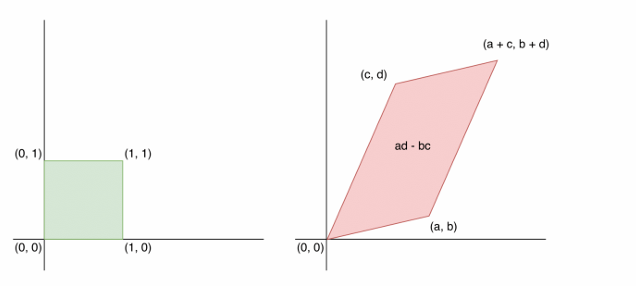
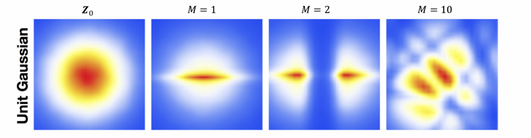
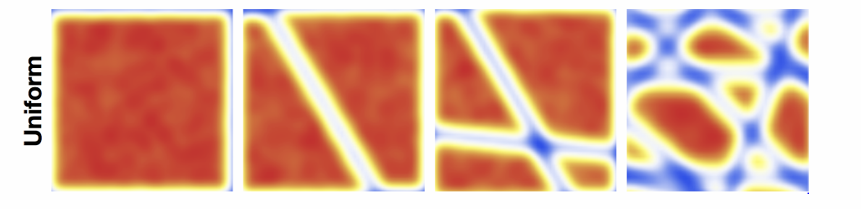
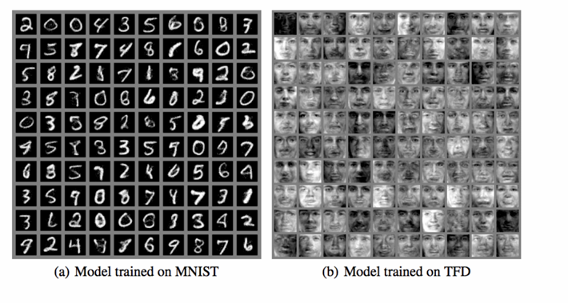
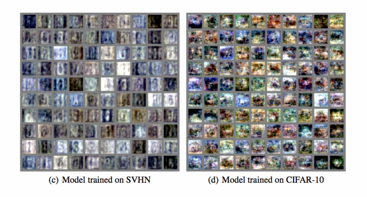
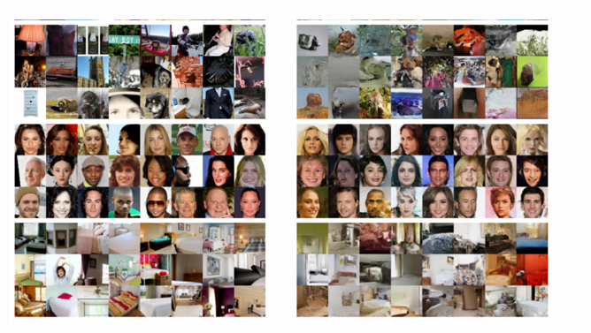
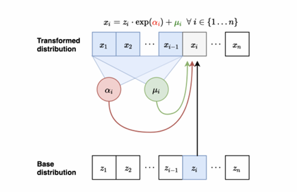
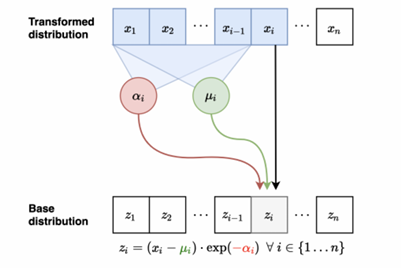

### Simple prior to complex data distributions
- Desired properties of any model distribution \( p_\theta(\mathbf{x}) \):
  - Easy to evaluate, closed form density (useful for training)
  - Easy to sample (useful for generation)
- Many simple distributions satisfy the above properties, e.g., Gaussian, uniform distributions
- Unfortunately, data distributions are more complex (multi-modal)
- Main idea behind normalizing flows (NFs): Map simple distributions (easy to sample and evaluate densities) to complex distributions through an invertible transformation

### VAE
- NFs are similar to VAEs:
  - Start from a simple distribution \( \mathbf{z} \sim p(\mathbf{z}) = \mathcal{N}(\mathbf{0}, \mathbf{I}_k) \)
  - Transform via \( p_\theta(\mathbf{x}|\mathbf{z}) = \mathcal{N}(f_\theta(\mathbf{z}), \sigma^2_{\text{dec}} \mathbf{I}_n) \)
  - Even though \( p(\mathbf{z}) \) is simple, the marginal \( p_\theta(\mathbf{x}) = \int p_\theta(\mathbf{x}, \mathbf{z})d\mathbf{z} \) is very complex/flexible
  - What if we could easily "invert" \( p(\mathbf{x}|\mathbf{z}) \) and compute \( p(\mathbf{z}|\mathbf{x}) \) by design? How?
- Make \( \mathbf{x} = f_\theta(\mathbf{z}) \) a deterministic and invertible function of \( \mathbf{z} \), so for any \( \mathbf{x} \) there is a unique corresponding \( \mathbf{z} \)

### Continuous random variables refresher
- Let \( X \) be a continuous r.v.
- The cumulative distribution function (CDF) of \( X \) is \( F_X(x) = \mathbb{P}(X \leq x) \)
- The probability density function (pdf) of \( X \) is \( p_X(x) = F'_X(x) = \frac{dF_X(x)}{dx} \)
- Typically consider parameterized densities:
  - Gaussian: \( X \sim \mathcal{N}(\mu, \sigma^2) \) with \( p_X(x) = \frac{1}{\sqrt{2\pi}\sigma} \exp\left(-\frac{(x-\mu)^2}{2\sigma^2}\right) \)
  - Uniform: \( X \sim \mathcal{U}(a, b) \) with \( p_X(x) = \frac{1}{b-a} \mathbb{I}_{\{a \leq x \leq b\}} \)
- If \( \mathbf{X} \) is a continuous random vector, we can represent it using its joint pdf:
  - Gaussian: \( \mathbf{X} \sim \mathcal{N}(\boldsymbol{\mu}, \boldsymbol{\Sigma}) \) with \( p_{\mathbf{X}}(\mathbf{x}) = \frac{1}{\sqrt{(2\pi)^d \det(\boldsymbol{\Sigma})}} \exp\left(-\frac{(\mathbf{x}-\boldsymbol{\mu})^\top \boldsymbol{\Sigma}^{-1}(\mathbf{x}-\boldsymbol{\mu})}{2}\right) \)

### Change of variables formula
- Let \( Z \) be a uniform r.v. \( \mathcal{U}[0, 2] \) with density \( p_Z \). What is \( p_Z(1) \)?
- Let \( X = 4Z \), and let \( p_X \) be its density. What is \( p_X(4) \)?
- \( p_X(4) = p(X = 4) = p(4Z = 4) = p(Z = 1) = p_Z(1) = 1/2 \)?
- Clearly, \( X \) is uniform in \( [0, 8] \), thus \( p_X(4) = 1/8 \)
- To get a correct result, we need to use change of variables formula

### Change of variables formula
- Change of variables (1D case): If \( X = f(Z) \) and \( f(\cdot) \) is monotone with inverse \( Z = f^{-1}(X) = h(X) \), then  
  \( p_X(x) = p_Z(h(x)) |h'(x)| \)
- Previous example: If \( X = f(Z) = 4Z \) and \( Z \sim \mathcal{U}[0, 2] \), what is \( p_X(4) \)?
  - Note that \( h(X) = X/4 \)
  - \( p_X(4) = p_Z(1) h'(4) = \frac{1}{2} \times \frac{1}{4} = \frac{1}{8} \)
- More interesting example: If \( X = f(Z) = \exp(Z) \) and \( Z \sim \mathcal{U}[0, 2] \), what is \( p_X(x) \)?
  - \( Z = h(X) = \log(X) \), and thus \( p_X(x) = p_Z(h(x)) \cdot \left|\frac{1}{x}\right| = \frac{1}{2x} \) for \( x \in [1, \exp(2)] \)
- Note that the "shape" of \( p_X(x) \) is different (more complex) from that of the prior \( p_Z(z) \)

### Change of variables formula
- Change of variables (1D case): If \( X = f(Z) \) and \( f(\cdot) \) is monotone with inverse \( Z = f^{-1}(X) = h(X) \), then  
  \( p_X(x) = p_Z(h(x)) |h'(x)| \)
- Proof sketch: WLOG, assuming that \( f \) is monotonically increasing. We have  
  \( F_X(x) = \mathbb{P}(X \leq x) = \mathbb{P}(f(Z) \leq x) = \mathbb{P}(Z \leq h(x)) = F_Z(h(x)) \)  
  Taking the derivative on both sides gives  
  \( p_X(x) = p_Z(h(x)) h'(x) \)
- Recall from basic calculus that \( h'(x) = (f^{-1})'(x) = 1/f'(f^{-1}(x)) \) (note that \( h'(x) = dz/dx \) and \( f'(z) = dx/dz \)). Hence,  
  \( p_X(x) = p_Z(h(x)) \cdot \frac{1}{f'(z)} \)

### Geometry: Determinants and volumes
- Let $\mathbf{Z}$ be a uniform random vector in $[0,1]^n$
- Let $\mathbf{X} = \mathbf{A}\mathbf{Z}$ for an invertible matrix $\mathbf{A} \in \mathbb{R}^{n \times n}$, with inverse $\mathbf{W} = \mathbf{A}^{-1}$. How is $\mathbf{X}$ distributed?
- Geometrically, the matrix $\mathbf{A}$ maps the unit hypercube $[0,1]^n$ to a parallelotope
- Hypercube and parallelotope are generalizations of square/cube and parallelogram/parallelepiped to higher dimensions

Figure: The matrix $\mathbf{A} = \begin{bmatrix} a & c \\ b & d \end{bmatrix}$ maps a unit square to a parallelogram.

---

### Geometry: Determinants and volumes
- The volume of the parallelotope is equal to the absolute value of the determinant of the matrix $\mathbf{A}$:
  $$\det(\mathbf{A}) = \det\left( \begin{bmatrix} a & c \\ b & d \end{bmatrix} \right) = ad - bc$$
- Let $\mathbf{X} = \mathbf{A}\mathbf{Z}$ for an invertible matrix $\mathbf{A} \in \mathbb{R}^{n \times n}$, with inverse $\mathbf{W} = \mathbf{A}^{-1}$. $\mathbf{X}$ is uniformly distributed over the parallelotope of area $\det(\mathbf{A})$. Hence, we have
  $$p_{\mathbf{X}}(\mathbf{x}) = p_{\mathbf{Z}}(\mathbf{W}\mathbf{x}) / |\det(\mathbf{A})| = p_{\mathbf{Z}}(\mathbf{W}\mathbf{x}) \cdot |\det(\mathbf{W})|$$
- Note that this is similar to the formula for 1D case

---

### Generalized change of variables
- For linear transformations specified via $\mathbf{A}$, change in volume is given by the determinant of $\mathbf{A}$
- For non-linear transformations $f(\cdot)$, the linearized change in volume is given by the determinant of the Jacobian of $f(\cdot)$
- Change of variables (general case): The mapping between $\mathbf{Z}$ and $\mathbf{X}$, given by $f: \mathbb{R}^n \to \mathbb{R}^n$, is invertible such that $\mathbf{X} = f(\mathbf{Z})$ and $\mathbf{Z} = f^{-1}(\mathbf{X})$, which leads to
  $$p_{\mathbf{X}}(\mathbf{x}) = p_{\mathbf{Z}}\left(f^{-1}(\mathbf{x})\right) \left| \det\left( \frac{\partial f^{-1}(\mathbf{x})}{\partial \mathbf{x}} \right) \right|$$
  - Generalizes the 1D case $p_{\mathbf{X}}(\mathbf{x}) = p_{\mathbf{Z}}\left(f^{-1}(\mathbf{x})\right) \left| (f^{-1})'(\mathbf{x}) \right|$
  - Unlike VAEs, $\mathbf{x}$ and $\mathbf{z}$ need to be continuous and of the same dimension
  - For any invertible matrix $\mathbf{A}$, $\det(\mathbf{A}^{-1}) = 1/\det(\mathbf{A})$
  $$p_{\mathbf{X}}(\mathbf{x}) = p_{\mathbf{Z}}(\mathbf{z}) \left| \det\left( \frac{\partial f(\mathbf{z})}{\partial \mathbf{z}} \right) \right|^{-1}$$

---

### Two dimensional example
- Let $Z_1$ and $Z_2$ be continuous r.v.'s with joint density $p_{Z_1, Z_2}$
- Let $u : \mathbb{R}^2 \to \mathbb{R}^2$ be an invertible transformation, and let $v$ be its inverse transformation
- Let $X_1 = u_1(Z_1, Z_2)$ and $X_2 = u_2(Z_1, Z_2)$. Then $Z_1 = v_1(X_1, X_2)$ and $Z_2 = v_2(X_1, X_2)$
  $$
  \begin{align*}
  p_{X_1, X_2}(x_1, x_2) &= p_{Z_1, Z_2}\left(v_1(x_1, x_2), v_2(x_1, x_2)\right) \cdot \left| \det\left( \begin{bmatrix} \frac{\partial v_1(x_1, x_2)}{\partial x_1} & \frac{\partial v_1(x_1, x_2)}{\partial x_2} \\ \frac{\partial v_2(x_1, x_2)}{\partial x_1} & \frac{\partial v_2(x_1, x_2)}{\partial x_2} \end{bmatrix} \right) \right| \\
  &= p_{Z_1, Z_2}(z_1, z_2) \cdot \left| \det\left( \begin{bmatrix} \frac{\partial u_1(z_1, z_2)}{\partial z_1} & \frac{\partial u_1(z_1, z_2)}{\partial z_2} \\ \frac{\partial u_2(z_1, z_2)}{\partial z_1} & \frac{\partial u_2(z_1, z_2)}{\partial z_2} \end{bmatrix} \right) \right|^{-1}
  \end{align*}
  $$

---

### Normalizing flows (NFs)
- Consider a directed, latent-variable model over observed variables $\mathbf{X}$ and latent variables $\mathbf{Z}$
- In a NF, the mapping between $\mathbf{Z}$ and $\mathbf{X}$, given by $f_{\theta} : \mathbb{R}^n \to \mathbb{R}^n$, is deterministic and invertible such that $\mathbf{X} = f_{\theta}(\mathbf{Z})$ and $\mathbf{Z} = f_{\theta}^{-1}(\mathbf{X})$
- Using change of variables, the marginal likelihood $p_{\theta}(\mathbf{x})$ is given by
  $$p_{\theta}(\mathbf{x}) = p_{\mathbf{Z}}\left(f_{\theta}^{-1}(\mathbf{x})\right) \left| \det\left( \frac{\partial f_{\theta}^{-1}(\mathbf{x})}{\partial \mathbf{x}} \right) \right|$$
- Note that $\mathbf{x}, \mathbf{z}$ need to be continuous and of the same dimension

以下是各页内容的Markdown格式转换：

### A flow of transformations
- Normalizing: Change of variables gives a normalized density after applying an invertible transformation
- Flow: Invertible transformations can be composed with each other
  $$\boldsymbol{z}_M = \boldsymbol{f}^{(M)} \circ \dots \circ \boldsymbol{f}^{(1)}(\boldsymbol{z}_0) = \boldsymbol{f}^{(M)}\left(\dots \left(\boldsymbol{f}^{(1)}(\boldsymbol{z}_0)\right)\right) := \boldsymbol{f}_\boldsymbol{\theta}(\boldsymbol{z}_0)$$

> - Start with a simple distribution for $\boldsymbol{z}_0$ (e.g., Gaussian)
> - Apply a sequence of $M$ invertible transformations to obtain $\boldsymbol{x} = \boldsymbol{z}_M$ from $\boldsymbol{z} = \boldsymbol{z}_0$
> - By change of variables (and chain rule)
>   $$p_{\boldsymbol{X}}(\boldsymbol{x}) = p_{\boldsymbol{Z}}(\boldsymbol{z}) \left| \det \left( \frac{\partial \boldsymbol{f}_\boldsymbol{\theta}(\boldsymbol{z})}{\partial \boldsymbol{z}} \right) \right|^{-1} = p_{\boldsymbol{Z}}(\boldsymbol{z}) \prod_{m=1}^M \left| \det \left( \frac{\partial \boldsymbol{f}_\boldsymbol{\theta}^{(m)}(\boldsymbol{z}_{m-1})}{\partial \boldsymbol{z}_{m-1}} \right) \right|^{-1}$$
> - Additionally, note that $\boldsymbol{z} = \boldsymbol{f}_\boldsymbol{\theta}^{-1}(\boldsymbol{x})$ implies $\boldsymbol{z}_0 = \left( \boldsymbol{f}_\boldsymbol{\theta}^{(1)} \right)^{-1} \left( \dots \left( \boldsymbol{f}_\boldsymbol{\theta}^{(M)} \right)^{-1} (\boldsymbol{z}_M) \right)$,
>   $$p_{\boldsymbol{X}}(\boldsymbol{x}) = p_{\boldsymbol{Z}} \left( \boldsymbol{f}_\boldsymbol{\theta}^{-1}(\boldsymbol{x}) \right) \left| \det \left( \frac{\partial \boldsymbol{f}_\boldsymbol{\theta}^{-1}(\boldsymbol{x})}{\partial \boldsymbol{x}} \right) \right| = p_{\boldsymbol{Z}} \left( \boldsymbol{f}_\boldsymbol{\theta}^{-1}(\boldsymbol{x}) \right) \prod_{m=1}^M \left| \det \left( \frac{\partial \left( \boldsymbol{f}_\boldsymbol{\theta}^{(m)} \right)^{-1} (\boldsymbol{z}_m)}{\partial \boldsymbol{z}_m} \right) \right|$$

### Planar flows (Rezende & Mohamed, 2016)
- Base distribution: Gaussian

- Base distribution: Uniform

- 10 planar transformations can transform simple distributions into a more complex one

### Learning and inference
- Learning via maximum likelihood estimation over the dataset $\mathcal{D}$, with objective
  $$\log p_\boldsymbol{\theta}(\mathcal{D}) = \sum_{\boldsymbol{x} \in \mathcal{D}} \left( \log p_{\boldsymbol{Z}} \left( \boldsymbol{f}_\boldsymbol{\theta}^{-1}(\boldsymbol{x}) \right) + \log \left( \left| \det \left( \frac{\partial \boldsymbol{f}_\boldsymbol{\theta}^{-1}(\boldsymbol{x})}{\partial \boldsymbol{x}} \right) \right| \right) \right)$$
- Exact likelihood evaluation via inverse transformation $\boldsymbol{x} \leftrightarrow \boldsymbol{z}$ and change of variables formula
- Sampling via forward transformation $\boldsymbol{z} \to \boldsymbol{x}$ with
  $$\boldsymbol{z} \sim p_{\boldsymbol{Z}}(\boldsymbol{z}),\quad \boldsymbol{x} = \boldsymbol{f}_\boldsymbol{\theta}(\boldsymbol{z})$$
- Latent representations inferred via inverse transformation (no inference network required!)
  $$\boldsymbol{z} = \boldsymbol{f}_\boldsymbol{\theta}^{-1}(\boldsymbol{x})$$

### Desiderata for flow models
- Simple prior $p_{\boldsymbol{Z}}(\boldsymbol{z})$ that allows for efficient sampling and tractable likelihood evaluation. E.g., isotropic Gaussian
- Invertible transformations with tractable evaluation:
  - Likelihood evaluation requires efficient evaluation of $\boldsymbol{x} \to \boldsymbol{z}$ mapping
  - Sampling requires efficient evaluation of $\boldsymbol{z} \to \boldsymbol{x}$ mapping
- Computing likelihoods also requires the evaluation of determinants of $n \times n$ Jacobian matrices ($n$ is the data dimension)
  - Computing the determinant for an $n \times n$ matrix is $O(n^3)$: Prohibitively expensive within a learning loop
  - Main idea: Choose transformations so that the resulting Jacobian matrix has special structure. For example, the determinant of a triangular matrix is the product of the diagonal entries, i.e., an $O(n)$ operation

### Triangular Jacobian
- We have
  $$\boldsymbol{x} = [x_1, \dots, x_n]^\top = \boldsymbol{f}(\boldsymbol{z}) = [f_1(\boldsymbol{z}), \dots, f_n(\boldsymbol{z})]^\top$$
  $$\boldsymbol{J} = \frac{\partial \boldsymbol{f}}{\partial \boldsymbol{z}} = \begin{bmatrix}
  \frac{\partial f_1}{\partial z_1} & \dots & \frac{\partial f_1}{\partial z_n} \\
  \dots & \dots & \dots \\
  \frac{\partial f_n}{\partial z_1} & \dots & \frac{\partial f_n}{\partial z_n}
  \end{bmatrix}$$
- Suppose that $x_i = f_i(\boldsymbol{z})$ only depends on $\boldsymbol{z}_{\leq i}$. Then,
  $$\boldsymbol{J} = \frac{\partial \boldsymbol{f}}{\partial \boldsymbol{z}} = \begin{bmatrix}
  \frac{\partial f_1}{\partial z_1} & 0 & \dots & 0 \\
  \frac{\partial f_2}{\partial z_1} & \frac{\partial f_2}{\partial z_2} & \dots & 0 \\
  \dots & \dots & \dots & \dots \\
  \frac{\partial f_n}{\partial z_1} & \frac{\partial f_n}{\partial z_2} & \dots & \frac{\partial f_n}{\partial z_n}
  \end{bmatrix}$$
  has lower triangular structure. Determinant can be computed in linear time
- Similarly, the Jacobian is upper triangular if $x_i$ only depends on $\boldsymbol{z}_{\geq i}$

### Planar flows (Rezende & Mohamed, 2016)

- Planar flow. Invertible transformation
  $$\mathbf{x} = f_\theta(\mathbf{z}) = \mathbf{z} + \mathbf{u}h(\mathbf{w}^\top \mathbf{z} + b)$$
  parameterized by $\theta = (\mathbf{w}, \mathbf{u}, b)$ and $h(\cdot)$ is a non-linearity

- Absolute value of the determinant of the Jacobian is given by
  $$\left| \det\left( \frac{\partial f_\theta(\mathbf{z})}{\partial \mathbf{z}} \right) \right| = \left| \mathbf{I}_n + h'(\mathbf{w}^\top \mathbf{z} + b)\mathbf{u}\mathbf{w}^\top \right| = \left| 1 + h'(\mathbf{w}^\top \mathbf{z} + b)\mathbf{w}^\top \mathbf{u} \right|$$

- Need to restrict parameters and non-linearity for the mapping to be invertible. For example, $h(\cdot) = \tanh(\cdot)$ and $h'(\mathbf{w}^\top \mathbf{z} + b)\mathbf{w}^\top \mathbf{u} > -1$

### Designing invertible transformations

- Nonlinear independent component estimation (NICE; Dinh et al., 2014) composes two kinds of invertible transformations: Additive coupling layers and rescaling layers
- Real-valued non-volume preserving (real NVP) transformations (Dinh et al., 2017)
- Inverse autoregressive flow (Kingma et al., 2016)
- Masked autoregressive flow (Papamakarios et al., 2017)
- I-resnet (Behrmann et al, 2018)
- Glow (Kingma et al, 2018)
- MintNet (Song et al., 2019)

### Additive coupling layers of NICE

- Partition the variables $\mathbf{z}$ into two disjoint subsets, say $\mathbf{z}_{1:d}$ and $\mathbf{z}_{(d+1):n}$ for any $1 \leq d \leq n$

  - Forward mapping $\mathbf{z} \rightarrow \mathbf{x}$:
    - $\mathbf{x}_{1:d} = \mathbf{z}_{1:d}$ (identity transformation)
    - $\mathbf{x}_{(d+1):n} = \mathbf{z}_{(d+1):n} + m_\theta(\mathbf{z}_{1:d})$ ($m_\theta : \mathbb{R}^d \rightarrow \mathbb{R}^{n-d}$ is a NN parameterized by $\theta$)

  - Inverse mapping $\mathbf{x} \rightarrow \mathbf{z}$:
    - $\mathbf{z}_{1:d} = \mathbf{x}_{1:d}$ (identity transformation)
    - $\mathbf{z}_{(d+1):n} = \mathbf{x}_{(d+1):n} - m_\theta(\mathbf{x}_{1:d})$

  - Jacobian of forward mapping:
    $$\mathbf{J} = \frac{\partial \mathbf{x}}{\partial \mathbf{z}} = \begin{bmatrix} \mathbf{I}_d & \mathbf{0}_{d \times (n-d)} \\ \frac{\partial \mathbf{x}_{(d+1):n}}{\partial \mathbf{z}_{1:d}} & \mathbf{I}_{n-d} \end{bmatrix}$$

- Volume preserving transformation since determinant is 1

### Rescaling layers of NICE

- Additive coupling layers are composed together (with arbitrary partitions of variables in each layer)
- Final layer of NICE applies a rescaling transformation
- Forward mapping $\mathbf{z} \rightarrow \mathbf{x}$:
  $$x_i = s_i z_i$$
  where $s_i > 0$ is the scaling factor for the $i$-th dimension
- Inverse mapping $\mathbf{x} \rightarrow \mathbf{z}$:
  $$z_i = \frac{x_i}{s_i}$$
- Jacobian of forward mapping:
  $$\mathbf{J} = \text{Diag}(\mathbf{s})$$
  $$\det(\mathbf{J}) = \prod_{i=1}^n s_i$$

### Samples generated via NICE

### Real NVP: Non-volume preserving extension of NICE

- Forward mapping \( \mathbf{z} \rightarrow \mathbf{x} \):
  - \( \mathbf{x}_{1:d} = \mathbf{z}_{1:d} \) (identity transformation)
  - \( \mathbf{x}_{(d+1):n} = \mathbf{z}_{(d+1):n} \odot \exp(\alpha_\theta(\mathbf{z}_{1:d})) + \mu_\theta(\mathbf{z}_{1:d}) \)（\( \alpha_\theta \) and \( \mu_\theta \) are both NNs from \( \mathbb{R}^d \) to \( \mathbb{R}^{n-d} \), parameterized by \( \theta \); \( \odot \) denotes elementwise product）
- Inverse mapping \( \mathbf{x} \rightarrow \mathbf{z} \):
  - \( \mathbf{z}_{1:d} = \mathbf{x}_{1:d} \) (identity transformation)
  - \( \mathbf{z}_{(d+1):n} = (\mathbf{x}_{(d+1):n} - \mu_\theta(\mathbf{z}_{1:d})) \odot \exp(-\alpha_\theta(\mathbf{z}_{1:d})) \)
- Jacobian of forward mapping:
  \[
  \mathbf{J} = \frac{\partial \mathbf{x}}{\partial \mathbf{z}} = \begin{bmatrix}
  \mathbf{I}_d & \mathbf{0}_{d \times (n-d)} \\
  \frac{\partial \mathbf{x}_{(d+1):n}}{\partial \mathbf{z}_{1:d}} & \text{Diag}(\exp(\alpha_\theta(\mathbf{z}_{1:d})))
  \end{bmatrix}
  \]
  \[
  \det(\mathbf{J}) = \prod_{i=d+1}^n \exp\left( (\alpha_\theta(\mathbf{z}_{1:d}))_i \right) = \exp\left( \sum_{i=d+1}^n (\alpha_\theta(\mathbf{z}_{1:d}))_i \right)
  \]
- Non-volume preserving transformation in general since determinant can be less than or greater than 1

### Samples generated via Real NVP

### Continuous autoregressive models as NFs

- Consider a Gaussian autoregressive model
  \[
  p(\mathbf{x}) = \prod_{i=1}^n p(x_i | \mathbf{x}_{<<i})
  \]
  such that \( p(x_i | \mathbf{x}_{<<i}) = \mathcal{N}(\mu_i(\mathbf{x}_{<<i}), \exp(\alpha_i(\mathbf{x}_{<<i}))^2) \)（\( \mu_i \) and \( \alpha_i \) are NNs for \( i > 1 \) and constants for \( i = 1 \)）
- Sample from this model:
  - Sample \( z_i \sim \mathcal{N}(0, 1) \) for \( i = 1, \dots, n \)
  - Let \( x_1 = \mu_1 + \exp(\alpha_1)z_1 \), and compute \( \mu_2(x_1), \alpha_2(x_1) \)
  - Let \( x_2 = \mu_2 + \exp(\alpha_2)z_2 \), and compute \( \mu_3(x_1, x_2), \alpha_3(x_1, x_2) \)
  - Let \( x_3 = \mu_3 + \exp(\alpha_3)z_3 \), and compute \( \mu_4(x_1, x_2, x_3), \alpha_4(x_1, x_2, x_3), \dots \)
- Flow interpretation: Transforms samples from the standard Gaussian \( (z_1, z_2, \dots, z_n) \) to those generated from the model \( (x_1, x_2, \dots, x_n) \) via invertible transformations (parameterized by \( \mu_i(\cdot) \) and \( \alpha_i(\cdot) \))

### Masked autoregressive flows (MAFs)

\( x_i = z_i \cdot \exp(\alpha_i) + \mu_i \ \forall i \in \{1..n\} \)

- Forward mapping from \( \mathbf{z} \rightarrow \mathbf{x} \):
  - Let \( x_1 = \exp(\alpha_1)z_1 + \mu_1 \), and compute \( \mu_2(x_1), \alpha_2(x_1) \)
  - Let \( x_2 = \mu_2 + \exp(\alpha_2)z_2 \), and compute \( \mu_3(x_1, x_2), \alpha_3(x_1, x_2) \)
  - Let \( x_3 = \mu_3 + \exp(\alpha_3)z_3 \), and compute \( \mu_4(x_1, x_2, x_3), \alpha_4(x_1, x_2, x_3), \dots \)
- Sampling is sequential and slow (like autoregressive models): \( O(n) \) computation time

### Masked autoregressive flows (MAFs)

\( z_i = (x_i - \mu_i) \cdot \exp(-\alpha_i) \ \forall i \in \{1..n\} \)

- Inverse mapping from \( \mathbf{x} \rightarrow \mathbf{z} \):
  - Compute all \( \mu_i, \alpha_i \) (can be done in parallel using e.g., MADE)
  - Let \( z_1 = (x_1 - \mu_1) \exp(-\alpha_1) \) (scale and shift)
  - Let \( z_2 = (x_2 - \mu_2) \exp(-\alpha_2), \dots \)
- Jacobian is lower diagonal, hence efficient determinant computation
- Likelihood evaluation is easy and parallelizable (like MADE)
- Reversing forward and inverse mappings of MAFs results in inverse autoregressive flows (IAFs), which has fast forward mapping and slow inverse mapping

### Summary of NFs

- Transform simple distributions into more complex distributions via change of variables
- Jacobian of transformations should have tractable determinant for efficient learning and density estimation
- Computational tradeoffs in evaluating forward and inverse transformations

