### 知识点1. Transformer基本定义与架构

#### Transformer网络定义
- A Transformer block is a family of functions $\mathbf{b} : \mathbb{R}^{n \times d} \to \mathbb{R}^{n \times d}$
- A Transformer is a stack of Transformer blocks: $\mathbf{f} = \mathbf{b}^{(L)} \circ \dots \circ \mathbf{b}^{(1)} : \mathbb{R}^{n \times d} \to \mathbb{R}^{n \times d}$
- We will use a Transformer to parameterize a NADE:
  $p_t(x_t|x_1, \dots, x_{t-1}) = \text{Cat}(\text{softmax}(\mathbf{f}_t(x_1, \dots, x_{t-1})))$
- Prefix function is defined by masking: $\mathbf{f}_t(x_1, \dots, x_{t-1}) = \mathbf{f}(\mathbf{m}_t \odot \mathbf{x})$

#### Transformer高层架构
- Let us look at the model as a single black box. In a machine translation application, it would take a sentence in one language, and output its translation in another
  

- More specifically, there are an encoding component, a decoding component, and connections between them
  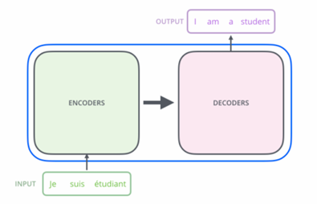

- The encoding component is a stack of encoders. The decoding component is a stack of decoders of the same number
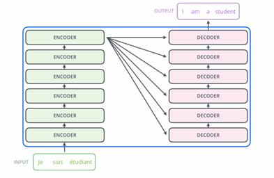

- The encoders are all identical in structure (yet they do not share weights). Each one is broken down into two sub-layers:
  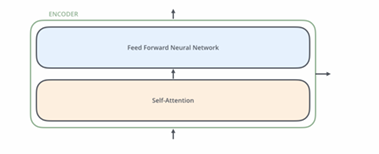

- The inputs of the encoder first flow through a self-attention layer, which helps the encoder look at other words in the input sentence as it encodes a specific word
- The outputs of the self-attention layer are fed to a feed-forward neural network. The exact same feed-forward network is independently applied to each position
- The decoder has both those layers, but between them is an attention layer that helps the decoder focus on relevant parts of the input sentence

  

#### 张量流动
- Let us start to look at the various vectors/tensors and how they flow between these components to turn the input of a trained model into an output
- As is the case in NLP applications in general, we begin by turning each input word into a vector using an embedding algorithm

  
  （Figure说明）：Each word is embedded into a vector of size 512

- The embedding only happens in the bottom-most encoder. The size of the vector is hyperparameter, typically set to the length of the longest sentence in the training dataset

- Each of the embedded vectors flows through each of the two layers of the encoder

  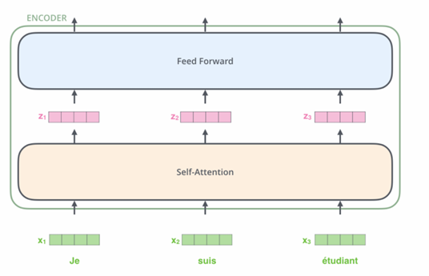

- Here we begin to see one important property of the Transformer, which is that the word in each position flows through its own path in the encoder. There are dependencies between these paths in the self-attention layer
- The feed-forward layer does not have those dependencies, however, and thus the various paths can be executed in parallel while flowing through the feed-forward layer

### 知识点2. Transformer核心组件

#### 残差连接与层归一化
- In more detail, each sub-layer (self-attention, ffn) in each encoder has a residual connection around it, and is followed by a layer-normalization step

  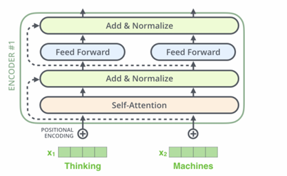

- This goes for the sub-layers of the decoder as well. If we are to think of a Transformer of 2 stacked encoders and decoders, it would look something like this:

  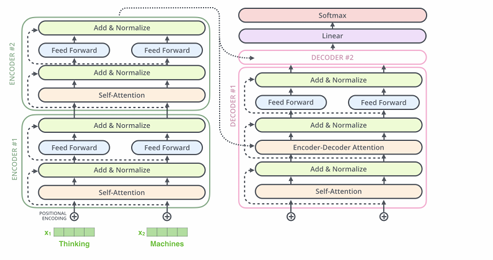

#### Transformer块结构
- For weights matrices $\mathbf{W}_Q, \mathbf{W}_K, \mathbf{W}_V \in \mathbb{R}^{d \times k}$, and input matrix $\mathbf{X} \in \mathbb{R}^{n \times d}$:
  1. Calculate
     $\mathbf{Q} = \mathbf{X} \times \mathbf{W}_Q \in \mathbb{R}^{n \times k} \ (\text{queries})$
     $\mathbf{K} = \mathbf{X} \times \mathbf{W}_K \in \mathbb{R}^{n \times k} \ (\text{keys})$
     $\mathbf{V} = \mathbf{X} \times \mathbf{W}_V \in \mathbb{R}^{n \times k} \ (\text{values})$
  2. Calculate
     $\mathbf{Z} = \text{softmax}\left( \frac{\mathbf{Q} \times \mathbf{K}^\top}{\sqrt{k}} \right) \times \mathbf{V} \in \mathbb{R}^{n \times k}$
     *注：$\text{softmax}(\mathbf{Q} \times \mathbf{K}^\top / \sqrt{k}) \in \mathbb{R}^{n \times n}$（attention matrix），softmax按行执行*
  3. For $\mathbf{W}_C \in \mathbb{R}^{k \times d}$, calculate $\tilde{\mathbf{U}} = \mathbf{Z} \times \mathbf{W}_C \in \mathbb{R}^{n \times d}$

- The weight matrices are not dependent on the sequence length $n$!!

- Multi-head attention:
  $\tilde{\mathbf{U}} = \sum_{i=1}^h \text{softmax}\left( \frac{(\mathbf{X}\mathbf{W}_Q^{(i)}) (\mathbf{X}\mathbf{W}_K^{(i)})^\top}{\sqrt{k}} \right) \times (\mathbf{X}\mathbf{W}_V^{(i)}) \times \mathbf{W}_C^{(i)} \in \mathbb{R}^{n \times d}$

- For each row of $\mathbf{X} = [\mathbf{x}_1, \dots, \mathbf{x}_n]^\top \in \mathbb{R}^{n \times d}$ and $\tilde{\mathbf{U}} = [\tilde{\mathbf{u}}_1, \dots, \tilde{\mathbf{u}}_n]^\top \in \mathbb{R}^{n \times d}$:
  - Calculate $\mathbf{u}_i = \text{LayerNorm}(\mathbf{x}_i + \tilde{\mathbf{u}}_i; \gamma_1, \beta_1)$ (Add & Normalize)
  - Calculate $\tilde{\mathbf{z}}_i = \mathbf{W}_2 \text{ReLU}(\mathbf{W}_1 \mathbf{u}_i + \mathbf{b}_1) + \mathbf{b}_2$ (Feed Forward), where $\mathbf{W}_1 \in \mathbb{R}^{m \times d}$, $\mathbf{b}_1 \in \mathbb{R}^m$, $\mathbf{W}_2 \in \mathbb{R}^{d \times m}$, $\mathbf{b}_2 \in \mathbb{R}^d$
  - Calculate $\mathbf{z}_i = \text{LayerNorm}(\mathbf{u}_i + \tilde{\mathbf{z}}_i; \gamma_2, \beta_2)$ (Add & Normalize)

- Layer normalization:
  $\text{LayerNorm}(\mathbf{z}; \gamma, \beta) = \gamma \frac{\mathbf{z} - \mu_{\mathbf{z}}}{\sigma_{\mathbf{z}}} + \beta$
  - $\mu_{\mathbf{z}} = \sum_{i=1}^d z_i / d$, $\sigma_{\mathbf{z}} = \sqrt{\sum_{i=1}^d (z_i - \mu_{\mathbf{z}})^2 / d}$
  - Normalize activations to have learned mean $\beta$ and variance $\gamma^2$
  - Applied per-sequence (not across batches)

### 知识点3. 自注意力机制与多头注意力

#### 自注意力机制
- Suppose that the following sentence is an input sentence we want to translate:
  > "The animal didn’t cross the street because it was too tired"
- What does "it" refer to? (street/animal) Simple for humans, not for algorithms
- When processing "it", self-attention lets the model associate "it" with "animal"
- As the model processes each word, self-attention lets it reference other positions for better encoding

- Maintaining a hidden state lets RNNs combine previous/current word representations
- Self-attention is how Transformers "bake" understanding of relevant words into the current word’s encoding
  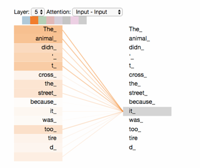

  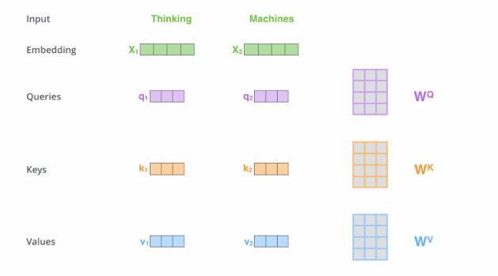
- ● The first step in calculating self-attention is to create two vectors from each of the input vectors of the encoder (in this case, the embedding of each word)
- ● For each word, we create a Query vector, a Key vector, and a Value vector. These vectors are created by multiplying the embedding by three matrices that we trained during the training process
- ● What are the "query", "key", and "value" vectors? They are abstractions that are useful for calculating and thinking about attention

  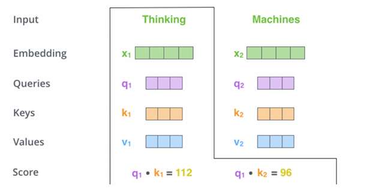
- ● The second step in calculating self-attention is to calculate a score. Say we are calculating the self-attention for the first word in this example, "Thinking"
- ● We need to score each word of the input sentence against this word. The score determines how much focus to place on other parts of the input sentence as we encode a word at a certain position
- ● The score is calculated by taking the dot product of the query vector with the key vector of the respective word we are scoring

  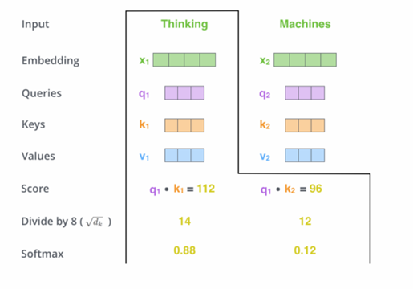
- ● The third and fourth steps are to divide the scores by 8 (the square root of the dimension of the key vectors 64. This leads to having more stable gradients)
- ● Then pass the result through a softmax operation. Softmax normalizes the scores so they are all positive and add up to 1
- ● This softmax score determines how much each word will be expressed at this position. Clearly the word at this position will have the highest softmax score, but sometimes it is useful to attend to another word that is relevant to the current word

- The fifth step is to multiply each value vector by the softmax score. The intuition here is to keep intact the values of the word(s) we want to focus on, and drown-out irrelevant words (e.g., by multiplying them by tiny numbers like 0.001)
- The sixth step is to sum up the weighted value vectors. This produces the output of the self-attention layer at this position (for the first word)

  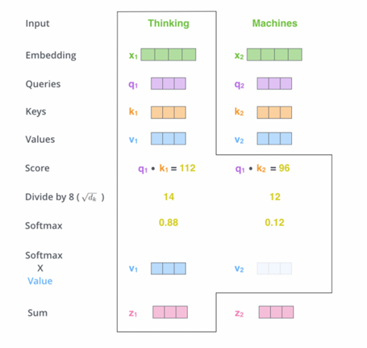
- That concludes the self-attention calculation. The resulting vector is one we can send along to the feed-forward neural network
- In the implementation, this calculation is done in matrix form for faster processing
- The first step is to calculate the Query, Key, and Value matrices, by packing inputs into a matrix $\mathbf{X}$ and multiplying it by the weight matrices we have trained

  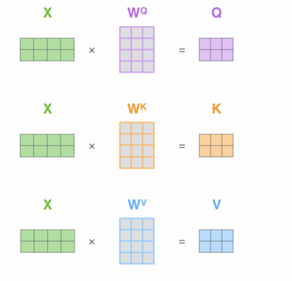
- Finally, since we are dealing with matrices, we can condense steps two through six in one formula to calculate the outputs of the self-attention layer

  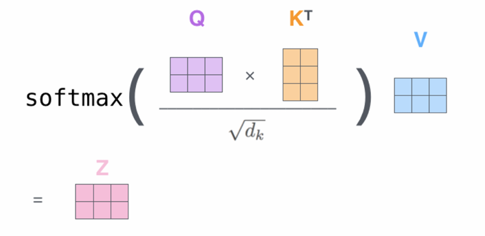

#### 多头注意力
  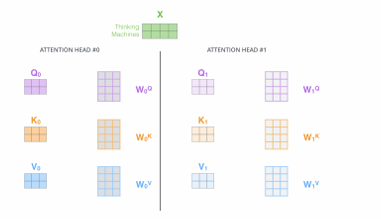
- Multi-head attention improves the performance of the attention layer in two ways:
  - It expands the ability of the model to focus on different positions
  - It gives the attention layer multiple "representation subspaces"
  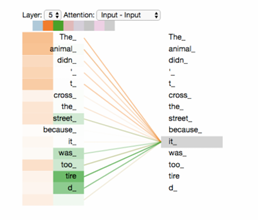

**Figure**: As we encode the word "it", one attention head is focusing most on "the animal", while another is focusing on "tired".

### 知识点4. 位置编码

- Transformer does not account for sequence position
- Need to encode sequence position as data
- Learn positional embeddings, or joint token-position embeddings, e.g., adding a vector to each input embedding
- These vectors follow a specific pattern that the model learns, which helps it determine the position of each word, or the distance between different words
  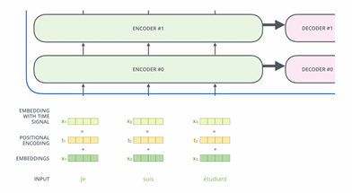
- If we assumed the embedding has a dimensionality of 4, the actual positional encodings would look like this:
  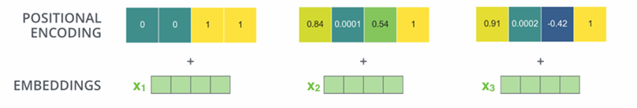

### 知识点5. 解码器结构

- The output of the top encoder is transformed into a set of attention vectors K and V
- These are to be used by each decoder in its "encoder-decoder attention" layer which helps the decoder focus on appropriate places in the input sequence
- The following steps repeat the process until a special symbol is reached indicating the transformer decoder has completed its output:
  - The output of each step is fed to the bottom decoder in the next time step, and the decoders bubble up their decoding results just like the encoders did
  - We also embed and add positional encoding to those decoder inputs to indicate the position of each word
  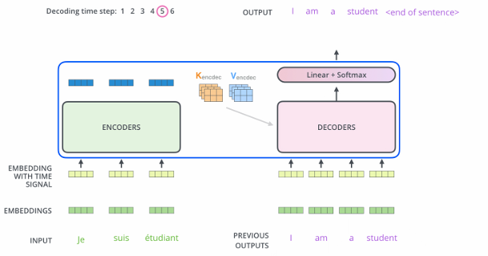

- In the decoder, the self-attention layer is only allowed to attend to earlier positions in the output sequence. This is done by masking future positions (setting them to −inf) before the softmax step in the self-attention calculation
- The "Encoder-Decoder Attention" layer works just like multiheaded self-attention, except it creates its Queries matrix from the layer below it, and takes the Keys and Values matrix from the output of the encoder stack
- The final linear and softmax layer turns the output of the decoder stack into a word
- The linear layer is a simple fully connected neural network that projects the output vector into a much larger vector called a logits vector (of the same dim. as the "output vocabulary" of the model)
- The softmax layer then turns those scores into probabilities. The cell with the highest probability is chosen, and the word associated with it is produced as the output for this time step

  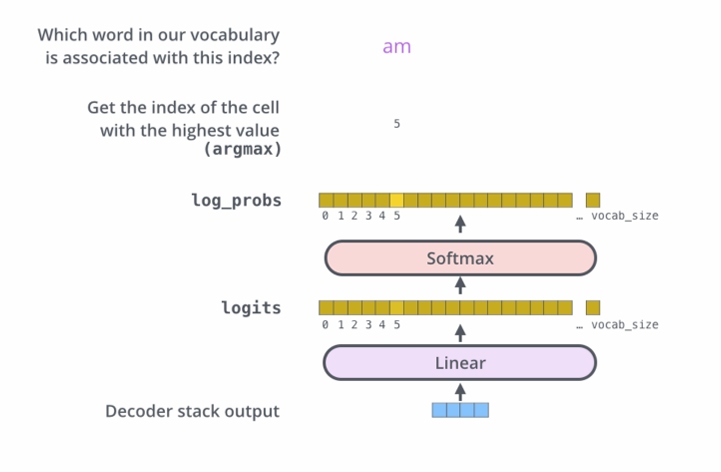

### 知识点6. 超参数选择

- Width of the Transformer block $d$
- Width of the internal position-wise feedforward network $m$
- Width of each Transformer head $k$
- Number of Transformer heads $h$
- Depth of the stack of Transformer blocks $L$
- Context length $n$
- All the usual hyper-parameters: Dropout, $L_2$, learning rates, initialization...

### 知识点7. Transformer变体（BERT与GPT）

#### Transformer、BERT和GPT的关系
- A Transformer uses encoder stack to model input, and uses decoder stack to model output (using input information from encoder side)
- If we are only interested in training a language model for the input for some other tasks, then we do not need the decoder of the Transformer. This gives us bidirectional encoder representations from Transformers (BERTs)
- But if we do not have input, we just want to model the "next word". We can get rid of the encoder side of a Transformer and output "next word" one by one, and this gives us GPTs

#### 编码器-only模型：BERT
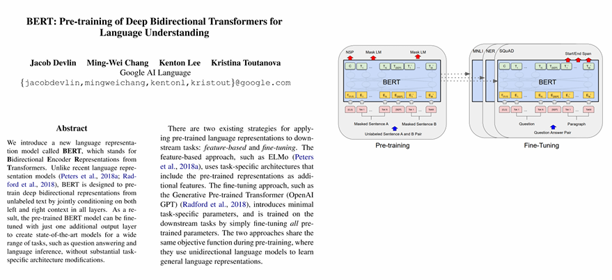

#### BERT预训练任务
- Pretraining Task 1: Masked words
  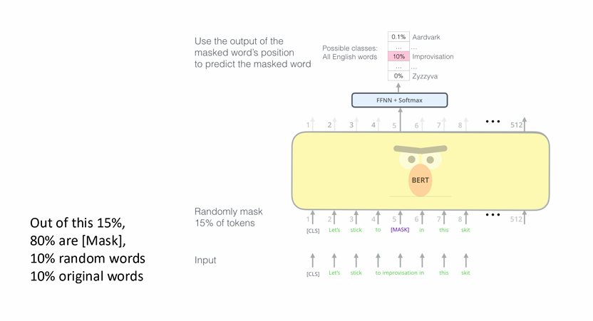
- Pretraining Task 2: Two sentences
  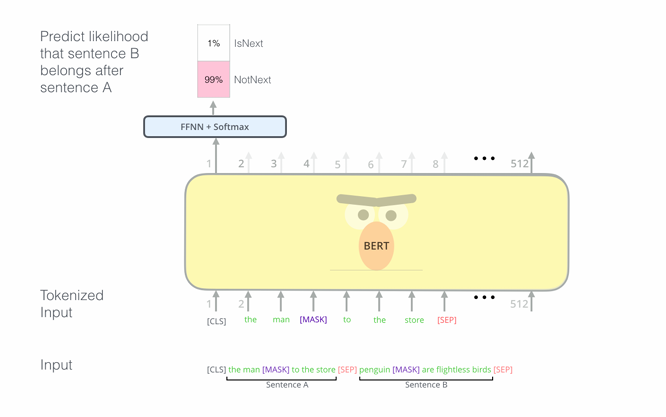

#### BERT微调
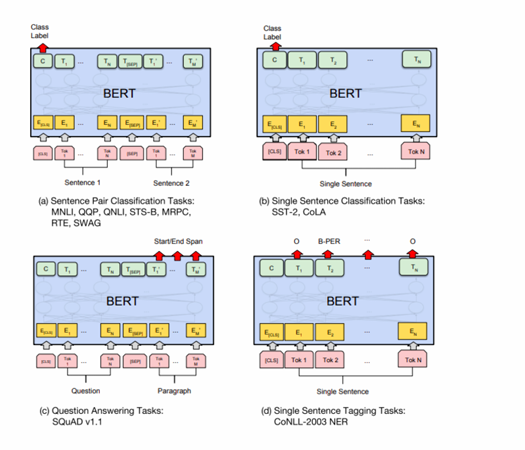

#### 解码器-only模型：GPT2
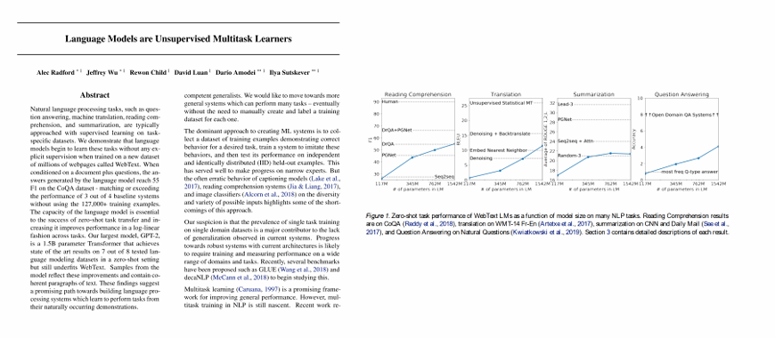

#### 模型缩放
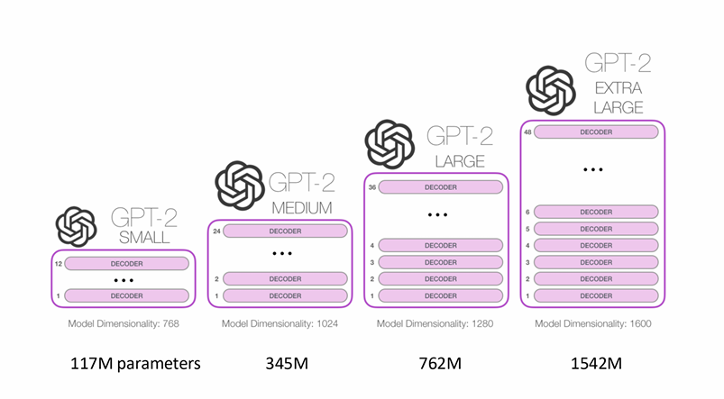

#### GPT预训练任务：下一个token预测
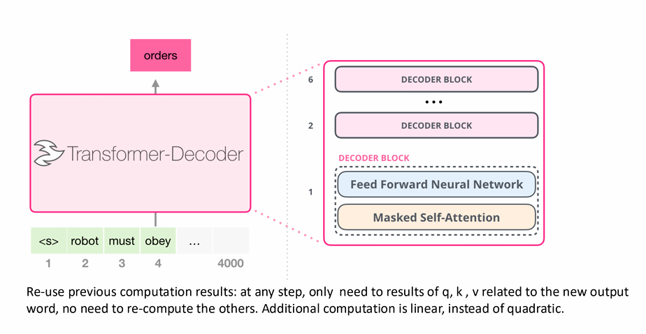

### 知识点8. Transformer的问题与解决方案

#### Transformer的问题
- Transformer problems:
  - Attention is quadratic during training
  - Attention causes quadratic memory bottleneck during inference
  - Positional encoding extrapolation failed

#### 现有解决方案
- Existing approaches:
  - Attention matrix approximations (sparse, low-rank, etc)
  - Linear Transformer, sparse Transformer
  - Linear state-space models (SSMs), structured SSMs, Mamba
  - Reformer, multi-query attention
  - Positional encoding: Rotary position embedding (RoPE), attention with linear biases (ALiBi)