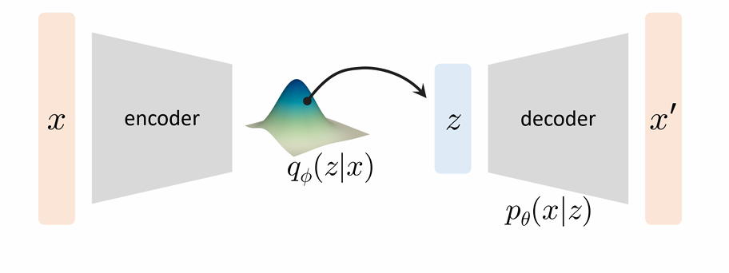
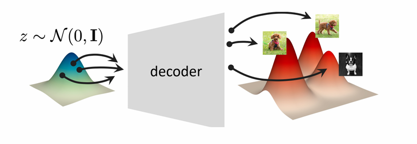
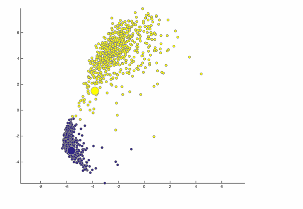
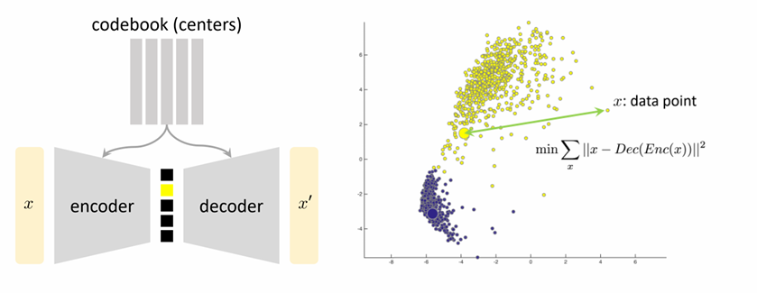
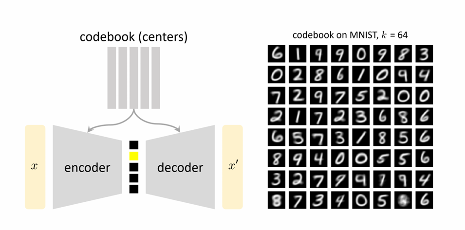
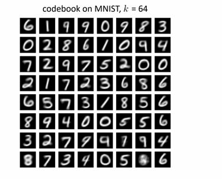
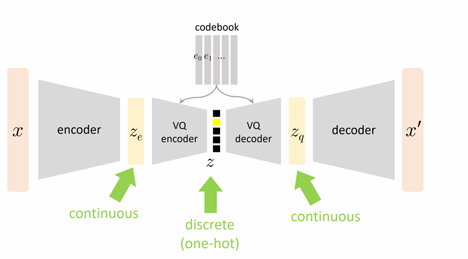

### Posterior inference
- For GMMs, it is easy to estimate the posterior $p_\theta(z|x)$ through Bayes' rule
- What if the model is not so simple?
  - What if the likelihood $p_\theta(x|z)$ is not just Gaussian?
  - What if the prior $p_\theta(z)$ is a continuous distribution?

### Approximate posterior inference
- How to estimate the posterior $q(z|x) \approx p_\theta(z|x)$?
- Learn a model that approximates the posterior!
- Let $q_\phi(z|x)$ be a family of density estimators with parameter $\phi$
- It is sometimes called amortized inference

### The Gaussian VAE
- Use a (unconditional) prior $p(z) = \mathcal{N}(0, \mathbf{I}_k)$ (k is a hyper-parameter)
- With a Gaussian likelihood $p_\theta(x|z) = \mathcal{N}(x; f_\theta(z), \sigma^2_{\text{dec}} \mathbf{I}_n)$ (assuming $x \in \mathbb{R}^n$)
- Here, $f_\theta : \mathbb{R}^k \to \mathbb{R}^n$ (the "decoder") is a neural net and $\sigma_{\text{dec}}$ is a hyper-parameter
- Use a posterior approximation $q_\phi(z|x) = \mathcal{N}(z; \mu_\phi(x), \sigma^2_\phi(x) \mathbf{I}_k)$
- Here, $\mu_\phi : \mathbb{R}^n \to \mathbb{R}^k$ (the "encoder") and $\Sigma_\phi : \mathbb{R}^n \to \mathbb{R}^{k \times k}$ are neural nets
- Think of it like a GMM with infinitely many components!

### The Gaussian VAE
- With a Gaussian likelihood $p_\theta(x|z) = \mathcal{N}(x; f_\theta(z), \sigma^2_{\text{dec}} \mathbf{I}_n)$
- Use a posterior approximation $q_\phi(z|x) = \mathcal{N}(z; \mu_\phi(x), \sigma^2_\phi(x) \mathbf{I}_k)$

### Evidence lower bound for Gaussian VAEs
- For a single instance $x$, we have
$$
\begin{align*}
\log(p_\theta(x)) &= \log\left( \int_z p_\theta(x,z)dz \right) \\
&= \log\left( \int_z q_\phi(z|x) \frac{p_\theta(x|z)p(z)}{q_\phi(z|x)} dz \right) \\
&\geq \int_z q_\phi(z|x) \log\left( \frac{p_\theta(x|z)p(z)}{q_\phi(z|x)} \right) dz \quad \text{(Jensen's inequality)} \\
&= \int_z q_\phi(z|x) \log(p_\theta(x|z))dz + \int_z q_\phi(z|x) \log\left( \frac{p(z)}{q_\phi(z|x)} \right) dz \\
&= \mathbb{E}_{q_\phi(z|x)} \left[ \log(p_\theta(x|z)) \right] - \text{KL}(q_\phi(z|x) \| p(z))
\end{align*}
$$
- Question: How can we maximize $\mathbb{E}_{q_\phi(z|x)} \left[ \log(p_\theta(x|z)) \right] - \text{KL}(q_\phi(z|x) \| p(z))$?

### Evidence lower bound for Gaussian VAEs
- **Question**: How can we maximize $\mathbb{E}_{q_\phi(z|x)} \left[ \log(p_\theta(x|z)) \right] - \text{KL}(q_\phi(z|x) \| p(z))$?
- We deal with the two terms separately
- Recall that if $P \sim \mathcal{N}(\boldsymbol{\mu}_0, \boldsymbol{\Sigma}_0)$ and $Q \sim \mathcal{N}(\boldsymbol{\mu}_1, \boldsymbol{\Sigma}_1)$ (with $\boldsymbol{\mu}_0, \boldsymbol{\mu}_1 \in \mathbb{R}^d$ and $\boldsymbol{\Sigma}_0, \boldsymbol{\Sigma}_1$ positive definite), then:
  $$2\text{KL}(P\|Q) = \text{tr}(\boldsymbol{\Sigma}_1^{-1}\boldsymbol{\Sigma}_0) + (\boldsymbol{\mu}_1 - \boldsymbol{\mu}_0)^\top \boldsymbol{\Sigma}_1^{-1} (\boldsymbol{\mu}_1 - \boldsymbol{\mu}_0) + \ln(\det(\boldsymbol{\Sigma}_1)/\det(\boldsymbol{\Sigma}_0)) - d$$
- Since $p(z) = \mathcal{N}(\mathbf{0}, \mathbf{I}_k)$ and $q_\phi(z|x) = \mathcal{N}(z; \boldsymbol{\mu}_\phi(x), \sigma_\phi^2(x)\mathbf{I}_k)$, we derive:
  $$\text{KL}(q_\phi(z|x) \| p(z)) = \frac{1}{2} \left( k\sigma_\phi^2(x) - k + \|\boldsymbol{\mu}_\phi(x)\|_2^2 - k\log\left(\sigma_\phi^2(x)\right) \right)$$

### Evidence lower bound for Gaussian VAEs
- To approximate $\mathbb{E}_{q_\phi(z|x)} \left[ \log(p_\theta(x|z)) \right]$, sample $\mathbf{z}_1, \dots, \mathbf{z}_M \sim q_\phi(\cdot|x)$:
  $$\mathbb{E}_{q_\phi(z|x)} \left[ \log(p_\theta(x|z)) \right] \approx \frac{1}{M} \sum_{m=1}^M \log(p_\theta(x|\mathbf{z}_m))$$
- Since $p_\theta(x|z) = \mathcal{N}(x; f_\theta(z), \sigma_{\text{dec}}^2 \mathbf{I}_n)$ (ignoring minor terms):
  $$\log(p_\theta(x|\mathbf{z}_m)) = -\frac{\|x - f_\theta(\mathbf{z}_m)\|_2^2}{2\sigma_{\text{dec}}^2}$$
- To sample from $q_\phi(\cdot|x)$ (recall $q_\phi(z|x) = \mathcal{N}(z; \boldsymbol{\mu}_\phi(x), \sigma_\phi^2(x)\mathbf{I}_k)$):
  $$\mathbf{z}_m = \boldsymbol{\mu}_\phi(x) + \sigma_\phi(x)\boldsymbol{\epsilon}_m, \quad \boldsymbol{\epsilon}_m \sim \mathcal{N}(\mathbf{0}, \mathbf{I}_k)$$

### The training of Gaussian VAEs
- Combining results, we **maximize**:
  $$-\frac{1}{M} \sum_{m=1}^M \frac{\|x - f_\theta(\boldsymbol{\mu}_\phi(x) + \sigma_\phi(x)\boldsymbol{\epsilon}_m)\|_2^2}{2\sigma_{\text{dec}}^2} - \frac{1}{2} \left( k\sigma_\phi^2(x) + \|\boldsymbol{\mu}_\phi(x)\|_2^2 - k\log\left(\sigma_\phi^2(x)\right) \right)$$
- Or **minimize**:
  $$\frac{1}{M} \sum_{m=1}^M \frac{\|x - f_\theta(\boldsymbol{\mu}_\phi(x) + \sigma_\phi(x)\boldsymbol{\epsilon}_m)\|_2^2}{2\sigma_{\text{dec}}^2} + \frac{1}{2} \left( k\sigma_\phi^2(x) + \|\boldsymbol{\mu}_\phi(x)\|_2^2 - k\log\left(\sigma_\phi^2(x)\right) \right)$$
- For training data $\mathbf{x}_1, \dots, \mathbf{x}_N$, the optimization problem is:
  $$\begin{aligned}
  \min_{\theta, \phi} \ &\sum_{i=1}^N \left( \frac{1}{M_i} \sum_{m=1}^{M_i} \frac{\|x - f_\theta(\boldsymbol{\mu}_\phi(\mathbf{x}_i) + \sigma_\phi(\mathbf{x}_i)\boldsymbol{\epsilon}_{i,m})\|_2^2}{2\sigma_{\text{dec}}^2} \right) \\
  &+ \sum_{i=1}^N \frac{1}{2} \left( k\sigma_\phi^2(\mathbf{x}_i) + \|\boldsymbol{\mu}_\phi(\mathbf{x}_i)\|_2^2 - k\log\left(\sigma_\phi^2(\mathbf{x}_i)\right) \right)
  \end{aligned}$$

### The generation of Gaussian VAEs
- Generation is simple:
  1. Pick a random latent vector $\mathbf{z} \in \mathbb{R}^k$ (where $\mathbf{z} \sim \mathcal{N}(0, \mathbf{I})$)
  2. Pass $\mathbf{z}$ through decoder $f_\theta$ to generate $x = f_\theta(z)$

- Analogous to the generation process of GMMs

### Vector quantized VAE (VQ-VAE)
- A key issue in Gaussian VAEs: **"posterior collapse"**:
  - Encoder outputs a *continuous* latent vector
  - Decoder becomes overly powerful (can reconstruct data from low-information latent vectors)
  - Encoder "gets lazy" (stops learning structured representations; latent space loses interpretability)
- VQ-VAE solves this by introducing a **discrete latent space** (forces encoder to learn meaningful representations)

### A running example of EM: K-means
- Assignment/partition: E-step
- Update mean vectors: M-step

### K-means as autoencoder
- Encode: Map \( x \) to one-hot
- Decode: Map one-hot to \( x' \) (a mean vector)

### K-means as autoencoder

### K-means as generative model
- Randomly sample \( z \sim \mathcal{U}([K]) \)
- Map \( z \) by the decoder
- Generated result is one codeword

- This is a valid generative model
- But not a "good" one
- But a good thought model

### VQ-VAE
The VQ-VAE architecture consists of three parts:
- Encoder: \( \mathbf{x} \to \mathbf{z}_e(\mathbf{x}) \in \mathbb{R}^D \)
- Vector quantization (VQ) layer: 包含可学习的codebook（嵌入空间）\( \mathbf{E} = [\mathbf{e}_1, ..., \mathbf{e}_k]^T \in \mathbb{R}^{k \times D} \)，找到索引 \( i \) 满足：
  $$i = \arg \min_{j \in [k]} \|\mathbf{z}_e(\mathbf{x}) - \mathbf{e}_j\|_2$$
  随后得到量化向量 \( \mathbf{z}_q(\mathbf{x}) = \mathbf{e}_i \)
- Decoder: 对量化向量解码 \( \mathbf{x}_q(\mathbf{x}) = G(\mathbf{z}_q(\mathbf{x})) \)

### VQ-VAE

### VQ-VAE
- 回顾高斯VAE的损失：\( -\mathbb{E}_{q_\phi(\mathbf{z}|\mathbf{x})} [\log(p_\theta(\mathbf{x}|\mathbf{z}))] + \text{KL}(q_\phi(\mathbf{z}|\mathbf{x}) \| p(\mathbf{z})) \)
- 对于VQ-VAE：
  - 关于 \( x \) 的重构损失与VAE一致：\( -\mathbb{E}_{q_\phi(\mathbf{z}|\mathbf{x})} [\log(p_\theta(\mathbf{x}|\mathbf{z}))] \)
    （即 \( -\log p(\mathbf{x}|\mathbf{z}_q(\mathbf{x})) \)；针对encoder和decoder优化）
  - 关于 \( z \) 的正则化损失 \( \text{KL}(q_\phi(\mathbf{z}|\mathbf{x}) \| p(\mathbf{z})) \) 概念上一致
  - 但需要对离散采样操作反向传播
  - 概念上等价于K-means的重构损失：\( \|\mathbf{z}_e(\mathbf{x}) - \mathbf{z}_q(\mathbf{x})\|_2^2 \)
- VQ-VAE论文中使用损失：\( \|\text{sg}[\mathbf{z}_e(\mathbf{x})] - \mathbf{e}\|_2^2 + \beta \|\mathbf{z}_e(\mathbf{x}) - \text{sg}[\mathbf{e}]\|_2^2 \)（对梯度做不同加权）
- \( \text{sg}[\cdot] \) 代表stop_gradient：将输入视为常数，反向传播时无梯度流过